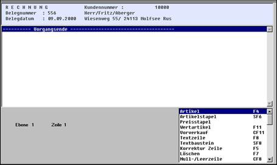

# Positionsteil: Anzeige und Erfassung

<!-- source: https://amic.de/hilfe/positionsteilanzeigeunderfassu.htm -->

Im Positionsteil werden die Positionen eines Vorganges erfasst bzw. bearbeitet.

**Achtung:** Nur vollständig eingerichtete Formulare und Erfassungsbildschirme ermöglichen die Abwicklung aller Vorgänge. Nachfolgende Beispiele beruhen auf der Standardeinrichtung von A.eins. In einer konkreten Installation ergeben sich optische und inhaltliche Abweichungen.

Oberhalb des Erfassungsteiles wird in drei Zeilen (einrichtbare) generelle Information zum Vorgang angezeigt (z.B. Kunde, Vorgangsnummer, ...)

Der Erfassungsbildschirm gliedert sich in drei Bereiche:

In der oberen Hälfte werden in 12 - 25 Zeilen die bereits erfassten Positionen angezeigt. Die gerade bearbeitete Zeile wird dunkel dargestellt.

Unten rechts werden in einer Auswahlbox die möglichen Erfassungsalter­nativen bzw. Bearbeitungsfunktionen dargestellt.

In Abhängigkeit von der gewählten Funktion wird eine Erfassungsbox geöffnet, die dann die Eingabe erlaubt.

### Anzeige der Positionen

Im Anzeigebereich werden die Positionen so dargestellt, wie es im Formulareinrichtungsprogramm festgelegt wurde. Häufig richtet sich die Optik nach dem auszudruckenden Formular, um die visuelle Kontrolle zu erleichtern. Bis zu 13 Zeilen werden dargestellt. Wenn mehr als 13 Positionen erfasst werden, ändert sich automatisch die Optik des Anzeigebildschirmes insofern, als am rechten Bildschirmrand eine Bildlaufleiste erscheint. Sie erlaubt es, ohne den Aufruf spezieller Funktionen mit Hilfe der Maus im Positionsteil zu blättern.
