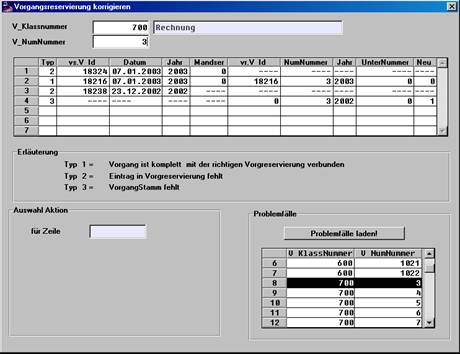

# Bedienelemente / Anzeigen

<!-- source: https://amic.de/hilfe/bedienelementeanzeigen.htm -->

Einen Überblick über den Zustand eines Beleges verschafft man sich durch Eingabe der Vorgangsklasse und der Belegnummer. Durch den Button ‚Problemfälle laden’‚ kann eine Liste aller problematischen Belege geladen werden (kann etwas dauern, da der gesamte Vorgangstamm untersucht wird). Durch Anklicken einer Zeile aus dieser Liste lässt sich ein Beleg zur Bearbeitung selektieren.

Die Belegübersicht zeigt Informationen aus dem Vorgangstamm (vs.V_id, vs_Datum, Jahrnummer), den Zustand im Mandantenserver (= DS_STATUS oder ----, falls kein Eintrag vorhanden ) und die wesentlichen Daten aus der Vorgreservierung(V_Id, v_NumNummer, V_UnterNummer , V_ResNeuKennz).

Wählt man aus der Belegübersicht eine Zeile an, so werden unter ‚Auswahl Aktion’ zu dem Typ passende Aktionen angeboten.

Es gibt folgende Typen:

- Vorgangstamm und Vorgreservierung sind korrekt miteinander verbunden, der Beleg ist zumindest technisch korrekt!
- Es gibt nur den Vorgangstamm, eine Vorgreservierung mit passender V_Id existiert nicht (= Vorgangsleiche ?!).
- Es gibt nur einen Eintrag in Vorgreservierung.

Diese Klassifizierung spiegelt aber nicht alle möglichen Konstellationen wieder. Insbesondere gibt es nach der Korrektur eines Beleges den (gewollten) Zustand, dass ein Vorgangstamm keine Vorgreservierung hat. Erst wenn der Mandantenserver den Originalbeleg vor der Korrektur per ‚technischen Storno’ entfernt hat, ist alles wieder im Lot. Generell gilt aber: Wenn der Mandantenserver alle Einträge bearbeitet hat und kein Benutzer in der Vorgangsbearbeitung verweilt, dann müssen alle Vorgreservierungen und Vorgangstämme 1 zu 1 (per V_Id) korrespondieren.

Folgende Aktionen können angeboten werden:
