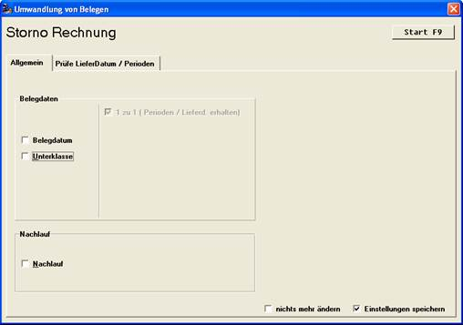

# Besonderheiten beim Kopieren:

<!-- source: https://amic.de/hilfe/besonderheitenbeimkopieren.htm -->

Es können mehrere Belege in einem Durchgang kopiert werden, bei mehr als einem Quellbeleg kann dann aber keine Belegnummer vorgegeben werden.

Hinweis:

Nur beim Kopieren werden die Originalbelege schon vor dem Starten mit F9 vorsortiert. Bei einer umfangreichen Auswahl kann diese Vorsortierung bei Bedarf mit der ESC Taste abgebrochen werden.

Stornobelege

Stornobelege sollen den Originalbeleg umkehren, daher wird bei dieser Umwandlungsfunktion das Häkchen ‚1 zu 1’ stets aktiviert, es kann nicht abgeschaltet werden.

Bei Problemen mit dem Lieferdatum und der Periode benutzen sie die Zusatzseite zur Problemlösung.
