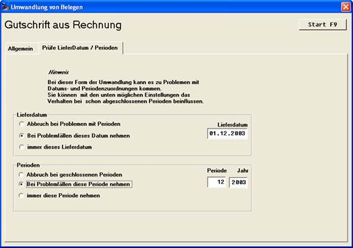

# Besonderheiten der Periodenbehandlung

<!-- source: https://amic.de/hilfe/besonderheitenderperiodenbehan.htm -->

Bei einigen Umwandlungsfunktionen wird eine weitere Dialogseite angezeigt („Prüfe Lieferdatum / Perioden). Es handelt sich hierbei um Funktionen, die im Hinblick auf die Perioden- und Datumszuordnung Belege weitgehend identisch zum Original erzeugen (Kopieren / Stornobelege / Gutschriften). Da es bei dieser Art Umwandlung häufig zu Problemen mit abgeschlossenen Perioden als auch Inventuren kommt, kann man mit dieser Zusatzseite Lösungen für die Problemfälle bereitstellen:

Achtung: Die Einstellungen dieser Seite werden nicht gespeichert!

Die Behandlung von Problemen mit dem Lieferdatum sowie von Perioden ist standardmäßig derart eingestellt, dass die entsprechende Funktion den Beleg nicht bearbeitet und in einem zusammenfassenden Protokoll die Unstimmigkeiten festgehalten werden. Mit der jeweils mittleren Einstellung kann, nur bei Problemfällen, ein Ersatzwert festgelegt werden.

Die jeweils dritte Einstellung (immer... nehmen) setzt für alle erzeugten Belege, unabhängig von etwaigen Perioden- oder Datumsverletzungen, fest die Werte ein.
