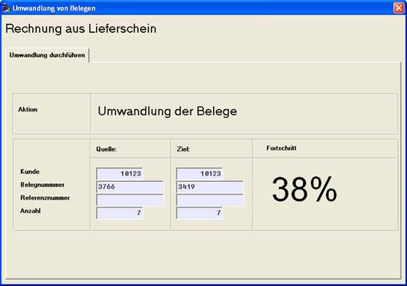

# Durchführung der Umwandlung

<!-- source: https://amic.de/hilfe/durchfhrungderumwandlung.htm -->

Nach Auslösen der Startfunktion und Bestätigung der Startabfrage wird die Umwandlung durchgeführt. Die Umwandlung kann zu jeder Zeit mit der ESC – Taste unterbrochen werden. Die Forschrittsanzeige in Prozent der Gesamtanzahl der (Quell) – Belege hilft Ihnen bei der Abschätzung der Gesamtzeit!
