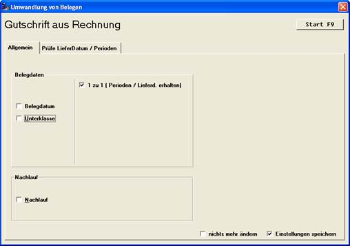
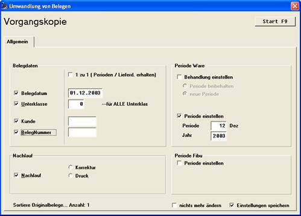

# Gutschriften und Belegkopien

<!-- source: https://amic.de/hilfe/gutschriftenundbelegkopien.htm -->

A.eins bietet jetzt die Möglichkeit, sowohl Gutschriften als auch Belegkopien in zwei Varianten zu erstellen. Zu diesem Zweck gibt es die Einstellung:

Mit dem Häkchen ‚(1 zu 1 (Perioden / Lieferdatum erhalten)’ wird festgelegt, ob Perioden und Lieferdaten des Ursprungsbeleges erhalten werden sollen. Die Gutschrift wirkt dann wie ein Stornobeleg. Die Einstellungen für Perioden sind dann deaktiviert, Belegdatum und Unterklasse können nach eigenem Ermessen abgeschaltet werden (die Daten des Quellbeleges werden übernommen), die Zusatzseite für Problemfälle erscheint aktiviert.

Ist das Häkchen nicht gesetzt, handelt es sich eher um eine Neuerfassung des Beleges.

Auf ähnliche Weise kann auch bei der Belegkopie verfahren werden. Auch hier gibt es das ‚1 zu 1’ Häkchen:

