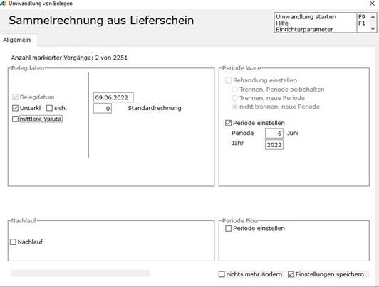
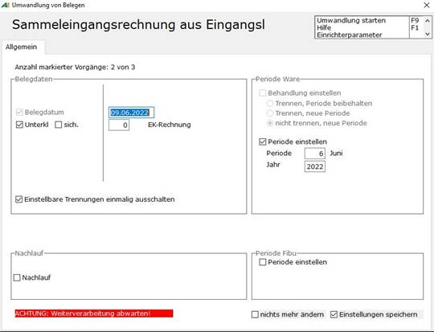

# Sammelumwandlung

<!-- source: https://amic.de/hilfe/sammelumwandlung.htm -->

Bei der Sammelumwandlung (nur bei Verkaufslieferscheinen!) ist die zusätzliche Option ‚mittlere Valuta’ hinzugekommen. Die Valutierung der Rechnung wird aus der nach Belegwert gewichteten Valutierung der zusammengefassten Lieferscheine gemittelt.

Achtung:

Dieses Verfahren ist nur sinnvoll, wenn in den Lieferscheinen folgende Bedingungen erfüllt sind:

In der Zahlungsbedingung muss ‚Bezug auf Lieferdatum’ eingestellt sein.

Es darf nur der Zahlungsbedingungstyp ‚1 = fällig in n Tagen’ benutzt werden

Mit angeschalteter Option ‚Einstellbare Trennungen einmalig ausschalten‘ wird bei der Umwandlung von Eingangslieferscheinen in Sammelrechnungen, Bestellungen in Sammellieferscheinen oder Sammelrechnungen die Prüfung der per Steuerparameter aktivierbaren Umwandlungs-Trennkriterien unterdrückt. Das kann zum Beispiel sinnvoll sein, wenn eine eingegangene Sammelrechnung zu bereits erfassten Eingangslieferscheinen per Umwandlung ‚Nacherzeugt‘ werden soll, die eingeschalteten Trennkriterien dieses aber verhindern würden.

Die Einstellung für die Vorbelegung bei Umwandlung von Eingangslieferscheinen in Sammelrechnungen wird mit dem Steuerparameter [SPA1123](../../firmenstamm/steuerparameter/trennkriterien_umwandlung/vorbelegung_trennung_bei_eingangslieferschein_zu_sammelrechn.md) vorbelegt und wird aus Sicherheitsgründen nicht gespeichert. Sie gilt somit nur für den aktuellen Umwandlungsprozess! 

Mit den Steuerparametern 1137 wird bei Umwandlung von Bestellungen in Eingangslieferscheinen entschieden, wie die Checkbox *Einstellbare Trennung einmalig ausschalten*, vorbelegt ist. Siehe. [SPA1137](../../firmenstamm/steuerparameter/trennkriterien_umwandlung/vorbelegung_trennung_bei_sammelumwandlung_von_bestellungen_z.md)

Mit den Steuerparametern 1138 wird bei Umwandlung von Bestellungen in Sammelrechnungen entschieden, wie die Checkbox *Einstellbare Trennung einmalig ausschalten*, vorbelegt ist. Siehe. [SPA1138](../../firmenstamm/steuerparameter/trennkriterien_umwandlung/vorbelegung_trennung_bei_sammelumwandlung_von_bestellungen_z_2.md)
