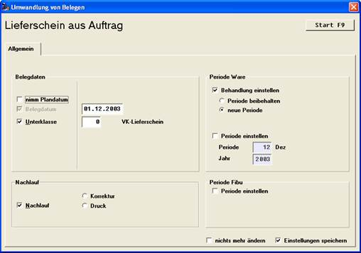

# Spezialität bei Aufträgen

<!-- source: https://amic.de/hilfe/spezialittbeiauftrgen.htm -->

Bei der Umwandlung gibt es das Häkchen ‚Nimm Plandatum’. Ist dieses gesetzt, so wird die Eingabe des Belegdatums ausgeblendet und das Plan / Lieferdatum des Auftrags wird als Belegdatum des Lieferscheins herangezogen.
