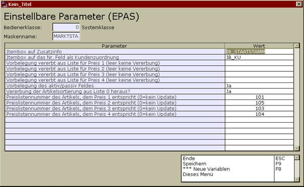

# Einrichterparameter

<!-- source: https://amic.de/hilfe/einrichterparameter1.htm -->

Die Einrichterparameter umfassen momentan folgende Bereiche:

Siehe auch:

- [Itembox auf Zusatzinfo](./itembox_auf_zusatzinfo.md)
- [Itembox der Nr. Feldes](./itembox_der_nr_feldes.md)
- [Vererbungsvorbelegung](./vererbungsvorbelegung.md)
- [Passiv-Aktiv Vorbelegung](./passiv_aktiv_vorbelegung.md)
- [Sortierung aus Liste 0](./sortierung_aus_liste_0.md)
- [Preislistennummern 1 bis 4](./preislistennummern_1_bis_4.md)
