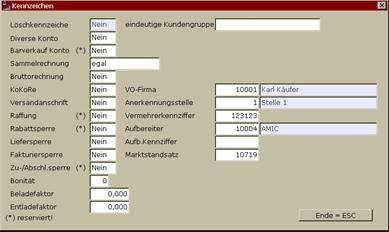

# Itembox der Nr. Feldes

<!-- source: https://amic.de/hilfe/itemboxdernrfeldes.htm -->

Normalerweise ist die Artikelstapel Listennummer ungebunden. Es kann beim Kunden in dem Bereich Zusatzangaben hinterlegt werden, welcher Kunde welche Listennummer ihm zugeordnet werden soll.

Im Feld Marktstandsatz ist im obigen Beispiel die Liste 10719 direkt mit diesem Kunden verbunden worden. Um nun eine direkt Kundenzuordnung zu gewährleisten, kann durch Angabe einer Itembox festgelegt werden, dass das Listennummernfeld immer an die Kundennummer gebunden werden soll. Wird eine neue Kundenbezogene Liste erstellt, so wird automatisch die Listenzuordnung im Kundenstamm eingetragen.
