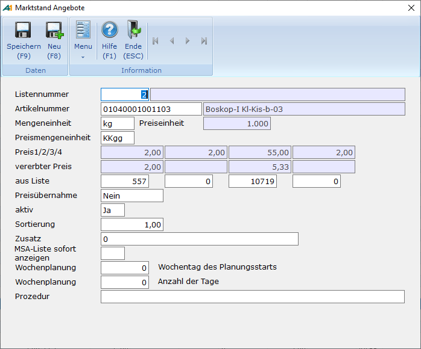

# Artikelstapel (Einrichtung)

<!-- source: https://amic.de/hilfe/artikelstapeleinrichtung.htm -->

Hauptmenü > Warenverkauf > Übergreifend > Artikelstapel (Marktstandangebote)

Direktsprung **[MSA]**

Im Modul Artikelstapel, welches im Kontextmenü der Vorgangstabelle (Direktsprung MAG) unter dem Menüpunkt Artikelstapel

zu erreichen ist (UMSCHALT F5), können freie Artikelstapel oder aber auch Kundenindividuelle Artikelstapel angelegt werden.

Ein Element eines Artikelstapels besteht aus folgenden Eigenschaften:

Siehe auch:

- [Listennummer](./listennummer.md)
- [Artikel](./artikel.md)
- [Preismengeneinheit](./preismengeneinheit.md)
- [Preis 1 bis 4](./preis_1_bis_4.md)
- [Vererbt aus Liste 1 bis 4](./vererbt_aus_liste_1_bis_4.md)
- [Preisübernahme](./preisuebernahme.md)
- [Aktivkennzeichen](./aktivkennzeichen.md)
- [Sortierung der Schnellerfassung](./sortierung_der_schnellerfassung.md)
- [Zusatzvorbelegung Warenposition](./zusatzvorbelegung_warenposition.md)
- [Einrichterparameter](./einrichterparameter/index.md)
- [Itembox auf Zusatzinfo](./einrichterparameter/itembox_auf_zusatzinfo.md)
- [Itembox der Nr. Feldes](./einrichterparameter/itembox_der_nr_feldes.md)
- [Vererbungsvorbelegung](./einrichterparameter/vererbungsvorbelegung.md)
- [Passiv-Aktiv Vorbelegung](./einrichterparameter/passiv_aktiv_vorbelegung.md)
- [Sortierung aus Liste 0](./einrichterparameter/sortierung_aus_liste_0.md)
- [Preislistennummern 1 bis 4](./einrichterparameter/preislistennummern_1_bis_4.md)
- [Sonderfunktionen](./sonderfunktionen/index.md)
- [Sortierung - Nachbearbeitung](./sonderfunktionen/sortierung_nachbearbeitung.md)
- [Aktiv Passivsetzung](./sonderfunktionen/aktiv_passivsetzung.md)
- [Preispflege](./sonderfunktionen/preispflege.md)
