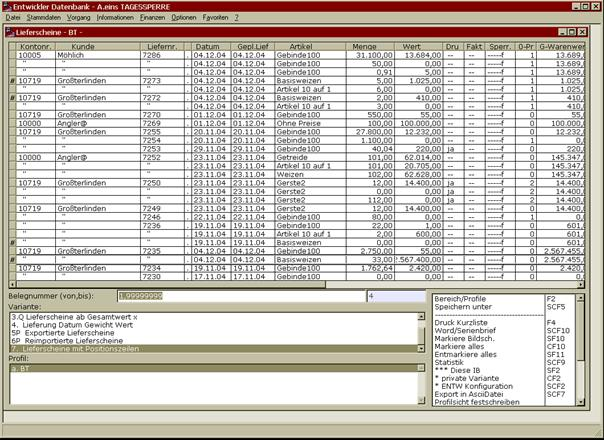
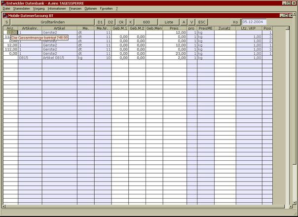

# Speichern unter auf Positionsebene

<!-- source: https://amic.de/hilfe/speichernunteraufpositionseben.htm -->

Sofern eine Auswahlliste mit Vorgängen auch die Einzelpositionen mit anzeigt, ist es möglich, mit der „Speichern unter“ Funktion einzelne Warenpositionen verschiedener Belege auf einen neuen Beleg zu kopieren, z.B. auf einen Bestellbeleg.

Im obigen Beispiel sind alle Basisweizen Lieferungen angewählt worden, um hieraus eine Bestellung an den Saatgutlieferanten erstellen zu können.

Wird bei der Schnellerfassung mit der Maus auf die Spalte Anz positioniert, so zeigt das System auch die Gesamtmenge an, um ggf. aus mehreren Einzelpositionen eine Gesamtposition zu machen.

Positionen, die als Anz eine 0 eingetragen haben, und aus dem Modul „Speichern unter“ kommen, werden trotzdem im Zielbeleg mit aufgeführt, um ggf. später bei der Verteilung auf den Ursprung zurückgreifen zu können.

Nbb.: Das Feld WabewErfassId wird mitgeführt, d.h. es kann nachvollzogen werden, welche Bestellposition zu welchem Lieferschein gehörte.
