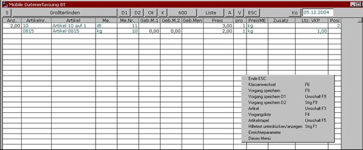

# Erfassung von Vorgängen als Tabelle

<!-- source: https://amic.de/hilfe/erfassungvonvorgngenalstabelle.htm -->

Die Schnellerfassung kann über den Direktsprung MAG aufgerufen werden. Es erscheint ein Bildschirm zur Erfassung der Kundennummer. Nach Eingabe wird auf Basis der im Kundenstamm hinterlegten [Artikelliste](../artikelstapel_einrichtung/index.md) eine Liste der Artikel angezeigt.

Folgende Funktionen stehen jetzt dem Bearbeiter zur Verfügung:

Siehe auch:

- [Kundenwechsel](./kundenwechsel.md)
- [Neuanfang](./neuanfang.md)
- [Klassenwechsel](./klassenwechsel.md)
- [Vorgang Speichern](./vorgang_speichern.md)
- [Vorgang Speichern mit Druck auf Unterklasse 1 und 2](./vorgang_speichern_mit_druck_auf_unterklasse_1_und_2.md)
- [Vorgang Speichern und sofort zur Korrektur aufrufen](./vorgang_speichern_und_sofort_zur_korrektur_aufrufen.md)
- [Artikelaufnahme](./artikelaufnahme.md)
- [Auflistung aller Vorgänge dieser Klasse](./auflistung_aller_vorgaenge_dieser_klasse.md)
- [Kopie oder Ersatzfunktion](./kopie_oder_ersatzfunktion.md)
- [Anzahl](./anzahl.md)
- [Gebindemaß 1 und 2](./gebindemass_1_und_2.md)
- [Gebindemenge](./gebindemenge.md)
- [Preis](./preis.md)
- [Preisfaktor](./preisfaktor.md)
- [Zusatzinfo](./zusatzinfo.md)
