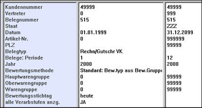
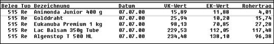

# Nachkalkulation Rohertrag

<!-- source: https://amic.de/hilfe/nachkalkulationrohertrag.htm -->

Für ausgewählte Vorgänge kann hiermit jederzeit eine Nachkalkulation des Rohertrages durchgeführt werden, wobei einstellbar ist, wie die Bewertung erfolgen soll:

Dies erfolgt in der Zeile „Bewertungsmethode“, wobei die Belegung aus dem Artikel als Standardeinstellung vorbelegt ist. Auf diese Art ist es dann z.B. möglich, einen Auftrag mit aktuellen EK-Preisen zu bewerten. Als Ergebnis wird folgende Darstellung ausgegeben:

