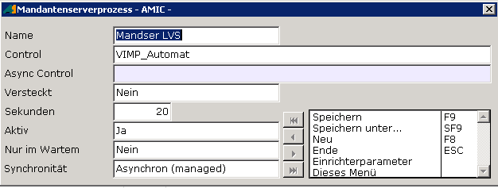

# Import per VIMP_Automat

<!-- source: https://amic.de/hilfe/importpervimpautomat.htm -->

Sie können auch einen asynchronen Mandantenserverprozess mit der Maske „VIMP_Automat“ anlegen. Dieser verarbeitet dann in definierten Zyklen die Importe bestimmter Vorgangsklassen.

Als Parameter kann dem VIMP_Automat eine Vorgangsklasse mitgegeben werden.

Default ist 5150 (LVS)
