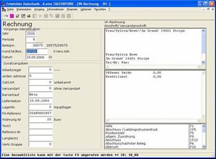

# Beispiele:

<!-- source: https://amic.de/hilfe/beispiele.htm -->

Vom Vorgangsdatum abweichendes Bepreisungsdatum

Um die Preisermittlung vom Vorgangsdatum (Rechnungsdatum) unabhängig zu machen, gibt es die Möglichkeit, ein separates Bepreisungsdatum mittels ***UFLD*** einzurichten, das ggf. auf der Hauptmaske des Vorgangs abgefragt wird und bei einer Eingabe die Grundlage für das Suchen nach Listen- und Individualpreisen sowie Rabatten und Zu-/Abschlägen liefert. Wurde kein separates Datum eingegeben, so gilt weiterhin das Vorgangsdatum als Grundlage.

Das Bepreisungsdatum wird aber selbstverständlich bei Umwandlungen an den Folgevorgang weitergereicht, so dass beispielsweise die Eingabe eines Bepreisungsdatums beim Auftrag oder Lieferschein in der Rechnung erhalten bleibt.

### Bonität

Es ist eine reine Anzeige aus dem Kundenstamm. Änderungsmöglichkeiten bestehen nicht.

### Steuergruppe

Anzeige der Steuergruppe des Kunden. Änderungen können sinnvoll sein, wenn es sich (im Ausnahmefall!) um eine Rechnung aus dem Ausland handelt, obwohl der Kunde im Inland sitzt. Sinnvoller ist es jedoch, die Standardeinstellung nicht zu verändern, sondern das Kundenkonto zusätzlich mit der anderen Steuereinstellung anzulegen.

### Fakturiergruppe

Hierbei handelt es sich um ein Auswertungskennzeichen, dessen Bedeutung im Unternehmen selbst festgelegt wird. Entsprechend sinnvoll können hier manuelle Änderungen sein.

### Zahlungsart

Vorbelegt mit der Standardzahlungsart des Kunden. Für einen konkreten Fall kann man jedoch hiervon abweichen, z.B., um einem Kunden, der normalerweise per Scheck bezahlt eine Nachnahmerechnung zu schicken.

Der Steuerparameter “Zahlungsart maximal wie im Kundenstamm” (Parametergruppe: Vorgangsbearbeitung allg.) hat folgende Bedeutung:

### “Ja” (Default):

Es kann nur eine kleinere Zahlungsart als vorgeschlagen eingegeben werden (z.B. Kundenstammeintrag 4 kann nur auf 1..3 geändert werden, nicht aber auf 5.

### “Nein”:

 keine Einschränkung bei der Vergabe

### Versandart

Vorbelegt aus dem Kundenstamm. Kann hier entsprechend der konkreten Situation überschrieben werden. Das kann allerdings auf viele Abläufe Einfluss haben:

Preisfindung

Frachtwesen

etc.

### Vertretergruppe

Vorbelegt aus dem Kundenstamm. Kann hier entsprechend der konkreten Situation überschrieben werden.

### Versandanschrift

Wenn für einen Kunden eine Versandanschrift vorliegt, wird sie automatisch abgefragt:

Bei mehreren Alternativen öffnet sich das bekannte Auswahlfenster und die ge­wünschte Anschrift wird ausgewählt. Man kann aber auch über die Funktion „Manuelle Versandadresse“ eine neue Versandanschrift für diesen Vorgang erfassen.

Nach Auswahl der gewünschten Anschrift wird sie zur Information in das rechte obere Anzeigefenster übernommen.

### Informelle Anschrift

Hier kann eine zusätzliche Anschrift erfasst werden, die zu informationszwecken auf Formulare gedruckt werden kann. So zum Beispiel ein von der Versand- oder Rechnungsanschrift abweichender Besteller oder eine informationelle Rechnung zu Händen von o.ä. .

### Plandatum / Lieferdatum

Das hier einzugebende Datum wird je nach Vorgangsklasse als geplantes Lieferdatum (Angebot, Auftrag) oder als Lieferdatum (Lieferschein, Rechnung, Gutschrift) interpretiert. Vorbelegt wird es mit dem Erfassungsdatum.

### Referenz - Nummer

Die Vorgangsnummer, auf die sich dieser Vorgang bezieht. Sie kann ausgedruckt und ausgewertet werden.

### Listenpreisklasse

Die Preisklasse, der Kunde zugeordnet ist, wird angezeigt und kann überschrieben werden. Damit wird jedoch evtl. auch automatisch ein anderer Preis vorgeschlagen.

### Sprache

Die Sprache, die Verwendung finden soll; übersteuert die Standardwerte aus dem Kundenstamm.

### Wiegenummer

Die Wiegenummer, auf die sich dieser Vorgang bezieht. Sie kann ausgedruckt und ausgewertet werden.

### Frachtklasse

Hier kann für Frachtberechnungen die aus dem Kundenstamm gelieferte Frachtklasse überschrieben und damit ein anderes Verfahren gewählt werden.

### Frachtvariante

Hier kann für Frachtberechnungen die aus Kunden- und Artikelstamm gelieferte Frachtvariante überschrieben und damit ein anderes Verfahren gewählt werden.

### Verkaufsgebiet

Das Verkaufsgebiet, auf die sich dieser Vorgang bezieht. Der Parameter kann ausgedruckt und ausgewertet werden.

### Gebiet von..., Gebiet nach

Für Entfernungsermittlungen im Rahmen der Frachtberechnung sind hier Eingaben erforderlich.

### LKW Nr. Motor, LKW Nr. Anhänger

Die LKW - Nummer, auf die sich dieser Vorgang bezieht. Sie kann ausgedruckt und ausgewertet werden.

### Fahrer

Der Fahrer, auf den sich dieser Vorgang bezieht. Er kann ausgedruckt und ausgewertet werden.

### Währung Nr., Kurs

Hier kann die aus dem Kundenstamm gelieferte Währung und der Standardkurs für diesen Vorgang geändert bzw. eingetragen werden.

### Objekt

Zuordnung des Objekts zum Vorgang.

### Zahlart

Zuordnung der Zahlart zum Vorgang.

### Weitere Funktionen im Rechnungskopf

Weitere Funktionen können über die Funktions-Box aufgerufen werden. Dies ist sowohl während der Kopferfassung als auch zum Abschluss möglich. Selbst aus der Positionserfassung kann man hierhin wechseln und wieder in sie zurückkehren. Ein Teil der Funktionen ist sicherlich erst zum Abschluss sinnvoll aufzurufen, so z.B. “Gesamtsummen”. Hieran orientiert sich deshalb auch nachfolgende Beschreibung.

Der Wechsel aus dem Erfassungsteil in die Box erfolgt mit (F12) und anschließender Selektion mittels der Cursortasten oder per Mausklick.

