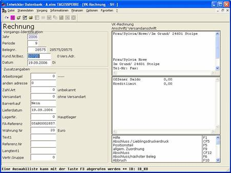

# Vorgangskopf

<!-- source: https://amic.de/hilfe/vorgangskopf.htm -->

Die Vorgangserfassung am Beispiel der Rechnung wird entweder über das Menüsystem, hier über den Anwahlpunkt Rechnungserfassung, mittels Direktsprung ***[REE]*** oder über den Anwahlpunkt Rechnungsbearbeitung ***[REB]*** und dann mit Taste ***F8*** aufgerufen. Es erscheint eine Erfassungsmaske, in deren linker Hälfte die erforderlichen Informationen des Vorgangs abgefragt werden, oben rechts werden Informationen zum Kunden angezeigt, unten rechts werden [Bearbeitungsfunktionen](./funktionen_vorgangserfassung_kopf.md) zur Verfügung gestellt, um die weitere Verarbeitung des Vorgangs zu steuern. Hervorzuheben sind hier insbesondere Funktionen zur Aktualisierung von Anschriften oder zur Verzweigung in den Positionsteil.

Zusätzlich sei hier noch einmal darauf hingewiesen, dass das Parametersystem in A.eins es erlaubt,

Abläufe zu verändern

optische Darstellungen anzupassen

abweichende Logiken zu verwenden.

Deshalb kann sich der Ablauf einer konkreten Anwendung vom nachfolgend beschriebenen Ablauf unterscheiden!

Siehe auch:

- [Belegnummer](./belegnummer.md)
- [Erfassung des Kunden](./erfassung_des_kunden.md)
- [Weitere Parameter](./weitere_parameter.md)
- [Beispiele:](./beispiele.md)
- [Funktionen Vorgangserfassung Kopf](./funktionen_vorgangserfassung_kopf.md)
- [Informationsbildschirm](./informationsbildschirm.md)
