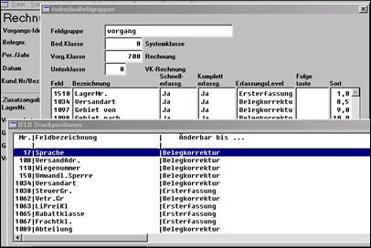

# Weitere Parameter

<!-- source: https://amic.de/hilfe/weitereparameter.htm -->

In vielen Anwendungen ist mit der Erfassung des Kunden die Kopfinformation abge­schlossen und es kann in die Erfassung der Artikelpositionen gewechselt werden.

A.eins bietet jedoch zahlreiche weitere Erfassungsmöglichkeiten an, die nachfolgend beschrieben werden.

### Zusatzangaben

Unterhalb des Feldes Kundennummer werden wichtige Steuerungsinformationen angezeigt und abgefragt, wie z.B. Vertreter, Versandart, Lieferanschrift. Hier stellen die Vorgangsklassen unterschiedliche Anforderungen.

Die konkrete Einstellung dieser Felder wird im Programmteil Individualfeldgruppen **[UFLD]** vorgenommen.

