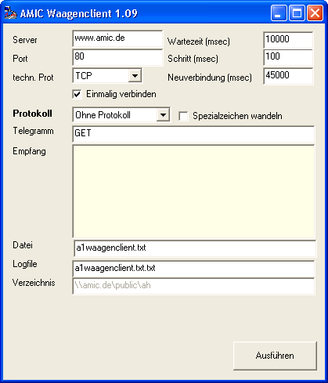
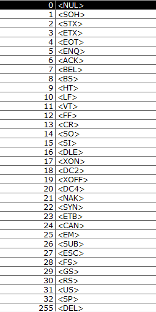
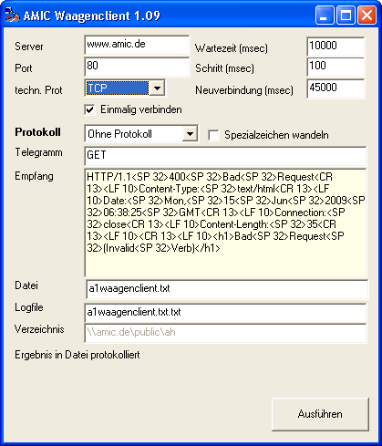

# AMIC TCP-Client

<!-- source: https://amic.de/hilfe/amictcpclient.htm -->

**Es wird die Verwendung dieses Clienten nicht länger empfohlen. Bitte stellen Sie wenn möglich auf** [**Aeinswiege**](./waagenterminals/standardwaagenprofil_unterstuetzung_aeinswiege.md) **um!**

Nach den guten Praxis-Ergebnissen des UDP-Clienten ist dieser, um die Möglichkeit auch auf TCP basierende Systeme bedienen zu können erweitert worden.

Um die neuen Möglichkeiten zu demonstrieren, verwende ich den exemplarischen Zugriff auf unseren Webserver, der sollte Internetzugang vorausgesetzt für Testzwecke wie diesen dann verfügbar sein.

Neu hinzugekommen ist das sogenannte „technische Protokoll“. Das ist notwendig um zwischen UDP- und TCP_Systemen unterscheiden zu können. Als logisches „Protokoll“ wird höchstwahrscheinlich in allen Anwendungen „Ohne Protokoll“ aktiviert sein. Beachten Sie bitte das bei Verwendung von Hardware-Lösungen die einen COM-Port umsetzen auf TCP es unter Umständen nötig ist das der Client eine entsprechende Protokoll-Anbindung erfährt, um solche Systeme auch „logisch“ bedienen zu können. Der Client besitzt außer dem einfachen Protokoll „ohne Protokoll“ ( was „schicken-warten-Holen“ bedeutet ) noch Anpassungen für die wesentlichen komplexeren Protokolle DDP-Protokolle.

Grade auch bei der 1:1-Umsetzung von COM auf TCP kann es nun passieren das den Wiegesystemen nicht druckbare Steuerzeichen, also solche z.B. im Bereich von 0 – 31 gesendet werden müssen. Für diese Spezialzeichen ist eine Metasprache analog den A.eins-Profilen eingeführt worden. So versendet man beispielsweise ein „Cariage Return (13)“ über das Metazeichen {CR}.

Es gilt die Umsetzung des A.eins-Formates COMBITHELPER, also

Bitte beachten Sie den Unterschied bei den Klammern, es werden geschweifte statt der Runden verwendet. Das ist notwendig, da der Waagenclient über Kommandozeile aufgerufen wird und die Kleiner bzw. Größerzeichen dort Umleitungen bedeuten!

Neben der eigentlichen Ergebnisdatei ist es nun noch möglich eine Logdatei zu schreiben die hauptsächlich dazu dient zu sehen, wann der Client genau welche Zeichen sendet und was er genau darauf erhält. Damit ist es dann unter Umständen möglich Abweichungen von Vorgaben zu erkennen und wiederum entsprechend darauf zu reagieren.

Unter „Verzeichnis“ zeigt das Programm an wo es sich befindet. Gerade in komplexen Terminalserver-Umgebungen kann es hilfreich sein zu sehen wo das Programm läuft.

Bringt man mit obigen Einstellungen das Programm zur Ausführung, dann erscheint nach kurzer Zeit

Was empfangen wurde ist an dieser Stelle nicht so wichtig, interessant ist vielmehr das man so die „Connectivity“ der Software „schnell mal testen“ kann.

Der Waagenclient ist nun mit einem expliziten Parameter „autostart“ ausgestattet, der bewirkt das sofortige Durchstarten der Anwendung und belässt das Hauptfenster der Anwendung unsichtbar. Nach Ausführung der Anwendung wird im Modus „autostart“ auch die Anwendung „automatisch“ beendet. Das ist also der Modus um vom A.eins-Standardwaagenprofil gerufen werden zu können.

Ein Wort noch zu den „Wartezeiten“. Auf das obige Beispiel bezogen bedeutet „Wartezeit“ von 10000 msec, dass die Software versucht, höchstens 10 Sekunden ein Ergebnis vom Server auf dem angegeben Port zu bekommen. Antwortet der Server innerhalb dieser 10 Sekunden dann wird, um sicherzustellen das man auch möglichst die gesamte Antwort erhält noch 100 msec gewartet, um zu schauen, ob nicht doch noch was mehr kommt. Dieses Feature kann und sollte verwendet werden um bei Waagen die etwas „brauchen“ nach Erhalt der Gewichtsanforderung aber schon mal diesen quittieren um dann „wenig später“ das Ergebnis schicken. „Schritt“ ist für Sie die „Stellschraube“, die sie empirisch langsam erhöhen sollten, bis das System immer ein Ergebnis liefert.

| Parameter | Default | |
| --- | --- | --- |
| IP | localhost | Die IP des Servers, also der „Waage“ bzw. der Netzwerkzugang der Waage |
| Port | 350 | Die berühmte „IP-Steckdose“ |
| Output | A1waagenclient.txt | Ausgabename und Pfad der Antwortdatei. |
| Send | | Der „Anforderungsstring“, siehe oben auch mögliche Behandlung von nicht-druckbaren Zeichen. |
| Timeout | 10000 | Wartezeit bis erste Reaktion |
| Modus | 2 | Protokoll ( für TCP-Verwendung wahrscheinlich immer erstmal 0, also ohne logisches Protokoll! ) |
| Techprot | 0 | 0 = UDP, 1 = TCP |
| Newconnect | 45000 | Nicht unterstützt |
| Logfile | | Standardmäßig ist der Default-Wert LEER was bedeutet das der Client die Ausgabedatei hernimmt und da ein .txt dranhängt für den Namen der Protokolldatei, Wenn Sie keine Protokolldatei schrieben möchten verwenden sie   logfile=-  |
| Wait | 100 | Der „Fortschritt“ ( richtige Wert muss empirsich gewonnen werden, in aller Regel reicht 100, oft ist es 500 ) |
| Replace | 0 | Berücksichtigung der Spezialzeichen aktivieren. |
| Autostart | 0 | \=1 fürht Programm automatisch Abfrage mit den gewählten Parametern durch und beendet sich anschließend automatisch wieder |
