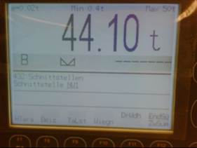
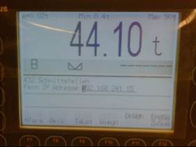
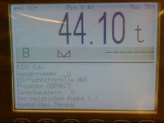
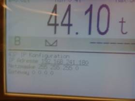
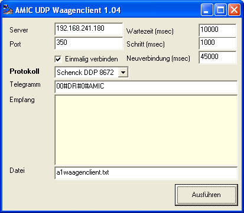
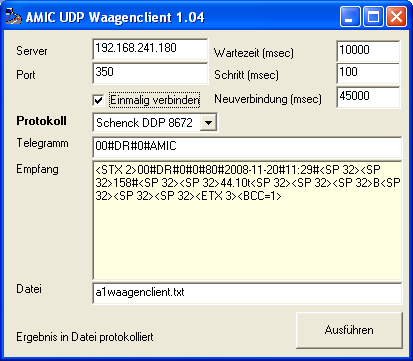
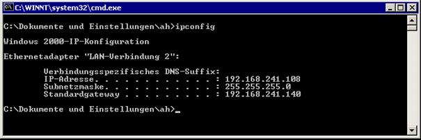
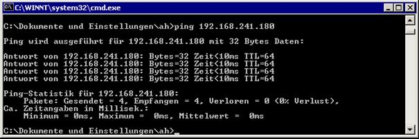
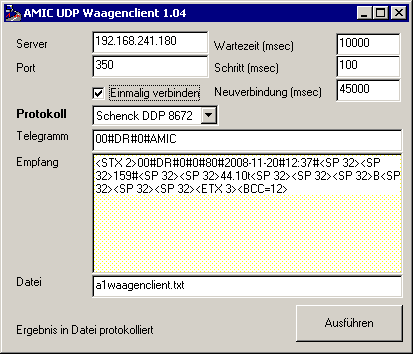
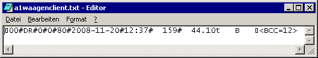

# AMIC UDP-Client

<!-- source: https://amic.de/hilfe/amicudpclient.htm -->

Der AMIC UDP-Client ist entwickelt worden um den Datentransfer mit dem Schenk-Waagenwiegeterminal *DISOMAT Tersus* durchzuführen. Der UDP-Client ist als Standalone-Applikation konstruiert worden.

Mit diesem Produkt sind somit gewährleistet:

Es kann für technische Connectivity-Prüfungen herangezogen werden.

Es kann direkt durch durch A.eins über das Standard-AMIC-Waagenprofil-Verfahren eingesetzt werden

Weiterentwicklungen des UDP-Clienten bedürfen keines A.eins-Gesamt-Updates

Für den *DISOMAT Tersus* sind 3 Kommunikations-Protokolle implementiert worden. Diese bauen technisch jeweils aufeinander auf. Ziel war es dafür zu sorgen dass die Schenck Process-Norm-Prozedur (DDP 8672) abgewickelt werden kann. Diese sorgt für einen gesicherten Transport der Wiegedaten im Eichbetrieb der Waage.

Die UDP-Schnittstelle von Schenck ist folgendermaßen aufgebaut bzw. macht folgende Vorgaben, die durch den UDP-Clienten abgewickelt werden:

2 UDP/IP Schnittstellen als weitere "virtuelle serielle Schnittstellen" vorzugsweise zur Kopplung mit der EDV Schnittstelle.

Unter 432:Schnittstellen können die neuen Schnittstellen "NW1" und "NW2" angewählt werden. Nach Anwahl einer der beiden "Schnittstellen" kann als einziger Parameter die "Fern-IP-Adresse" konfiguriert werden. Diese legt fest, zu welcher Server-IP **aktive** Ausgaben geschickt werden.

Unter 4331:Edv kann dann NW1 bzw NW2 als "Schnittstelle" gewählt werden. Der DISOMAT öffnet dann für NW1 den UDP Port 350 und für NW2 den UDP Port 351. Über diesen können externe Programme "Datengramme" an den DISOMAT übertragen, die vorzugsweise jeweils eine ganze "EDV-Einheit" (Ack, Nac, Telegramm) enthalten.

Mit Eingang des ersten Datengramms einer Gegenstelle schaltet der DISOMAT den UDP Port in den **verbundenen** Modus, d. h. er akzeptiert ab jetzt nur noch Datengramme von der Gegenstelle, die das Datengramm geschickt hat und er antwortet auch nur dieser Gegenstelle. Dieser **verbundene** Modus endet 45 Sekunden nach dem letzten Empfang der Gegenstelle. Ab jetzt akzeptiert der DISOMAT wieder Datengramme von **jeder** Gegenstelle.

Somit ist der *Disomat Tersus* entsprechend vorzukonfigurieren.

Um die Beschreibung der Parameter im UDP-Clienten zu vereinfachen dokumentiere ich hier die Einstellungen des *Disomat Tersus-Testgerätes.*

Mit Hilfe des Passwortes Standard-Passwortes 618349 kommt man in folgende Dialoge, die man dann entsprechend der jeweiligen Vorgaben ausfüllen muss.

Wenn das soweit erledigt ist kann man an den Test mit dem UDP-Clienten herangehen.

Der UDP-Client ist als allein stehendes Programm nutzbar, befindet sich aber bei neueren A.eins-Versionen im Bin-Verzeichnis von A.eins. Es ist im Normalfall ohne Installation sofort einsetzbar.

Intern verwendet es ein Objekt von Microsoft das in seltenen Fällen noch nicht auf dem verwendeten Rechner installiert sein kann. In diesen Fällen kann man das Objekt leicht mit einem dafür entwickelten Installationsprogramm nachrüsten.

Nach Start und Eingabe der Verbindungsdaten stellt sich das Ganze nun so da:

| Server | Die IP-Adresse des Disomat Tersus |
| --- | --- |
| Port | Der entsprechende Port zu NW1 |
| Protokoll | Das verwendete Protokoll zur Kommunikation mit dem Disomat Tersus Standard sollte „Schenck DDP 8672“ sein.   Weiterhin möglich sind Schenck DDP 8785 ( Poll-Prozedur ) Sowie die Schenck-MiniProz bei der es sich um eine 1:1 – Umsetzung ohne Prüfsummenverfahren handelt. |
| Einmalig verbinden | Macht UDP nur einmal auf. Unterstützt somit direkt die Schenck-UDP-Implementierung ( 45 Sekunden – Regel! ) |
| Wartezeit | Solange wird maximal auf eine Antwort gewartet, wenn der Client eigentlich eine gemäß Protokoll-Spezifikation erwartet.   10 Sekunden erscheinen mir momentan angemessen und das wird auch als Standard vorgegeben. |
| Schritt | Die Zeit die nach Dateneingang noch gewartet wird bis das System annimmt das die Übertragung abgeschlossen ist.   Der Wert ist sicherlich abhängig vom Netzverhalten insgesamt, bei meinen Tests denke ich das 100 ms ein guter Wert sein könnte. |
| Neuverbindung | Für die Installations- und Einrichtungsphase kann es sehr hilfreich sein wenn der Client einem geeignet hilft die 45-Sekunden-Regel zu beachten. |
| Telegramm | Das Daten-Telegramm der eigentlichen Anforderung. Die Telegramme entnimmt man den Schenck-Handbüchern. Ebenso was genau die einzelnen Telegramme bewirken.   Für den Test dieser Anwendung habe ich das Telegramm verwendet um eine Eichwiegung zu veranlassen.   Das ist ja auch genau das Einsatzgebiet dieser Applikation. |
| Datei | Pfad und Name des Wiegeergebnis zur späteren Auswertung in A.eins |
| Empfang | Die Rückgabe des Wiegeergebnisses des Wiegeterminals. |

Führt man nun den Wiegeauftrag aus, so stellt sich das System nach kurzer Zeit so da:

Im **Empfang** ist nun das Anwort-Telegramm zu erkennen. Dieses ist in die **Datei** abgelegt worden und steht damit in A.eins zur weiteren Auswertung zur Verfügung.

In A.eins wird auch der konkrete Aufbau analysiert und daraus die Wiegedaten ermittelt.

Anzumerken ist an dieser Stelle noch das im Datentelegramm vom AMIC UDP Clienten – ähnlich wie in A.eins – die nicht druckbaren Sonderzeichen in lesbarer Form dargestellt werden. Dies geschieht in der Form z.B. &lt;STX 2>. Es handelt sich also um das Zeichen mit dem Wert 2.

Das BCC-Prüfsummenverfahren von Schenck wird explizit durch den AMIC UDP-Clienten durch die Notation &lt;BCC=Wert> visualisiert. Das Vorhandensein einer &lt;BCC>-Notation im Antwort-Telegramm signalisiert also die technisch einwandfreie Übertragung und kann als zusätzliche Prüfoption in A.eins zum Absichern des Transports herangezogen werden.

Für die Ansteuerung aus dem AMIC-Standardwaagenprofil heraus unterstützt der AMIC UDP-Client folgende Kommandozeilen-Parameter:

| Parameter | Bedeutung | Vorbelegung |
| --- | --- | --- |
| IP | Angabe der Server-IP ( also des DISOMAT Tersus ) | Localhost |
| PORT | Angabe des Server-Portes | 350 |
| OUTPUT | Datei Pfad und Name des Wiegeergebnisses | a1waagenclient.txt |
| SEND | Das Anforderungstelegramm | |
| Modus | Das Protokoll. Hierbei gilt 0 = Ohne Protokoll 1 = Schenck DDP 8785 2 = Schenck DDP 8672 | 0 |
| Timeout | Wartezeit | 10000 |
| Wait | Schritt | 100 |
| Newconnect | Neuverbindung | 45000 |

**Der AMIC-UDP-Client führt einen Autostart dann durch, wenn IP, PORT und SENDE angegeben sind. Nach der Abwicklung des Protokollverfahrens beendet er sich automatisch.**

Anhang: Beispiel-Installation in der Praxis

Für den Test der Anwendung habe ich den UDP-Clienten auf einen unserer heimischen Warenwirtschaftsserver in das dortige Aeins-BIN-Verzeichnis verbracht. Es handelt sich um einen Windows 2000 – Terminal – Server. Die IP des Terminal-Servers ist

Der DISOMAT Tersus antwortet auf das Ping-Protokoll:

Bitte beachten, dass die Verbindung über das Ping-Protokoll weder notwendig noch hinreichend dafür ist das auch der UDP-Transport über Firewalls hinweg funktioniert! Immerhin ist es bei enstprechender Funktionalität eine gute Rückversicherung das „am anderen Ende“ zumindest ein Gerät erreichbar ist …

Diese IP 192.168.241.108 muss im DISOMAT Tersus unter Punkt 432 für die Schnittstelle NW1 hinterlegt werden. Ist das erledigt so zeigt ein erster Programmstart mit den Einstellungen wie folgt angegeben:

Die Datei a1waagenclient.txt im Bin-Verzeichnis von Aeins sieht so aus:

Es handelt sich um den Originalrückgabestring des DISOMAT Tersus, angereichert um die schon vom AMIC-UDP-Clienten überprüfte BCC-Prüfsummenmechanik und bereitgestellt für die AMIC-Waagenprofile zum prüfen.

Damit ist die technische Verifikation sichergestellt und es kann eine Anbindung ans A.eins erfolgen.

Siehe auch:

- [Integration des AMIC UDP-Client als Anwendung der AMIC-Standardwaage](./integration_des_amic_udp_client_als_anwendung_der_amic_stand.md)
