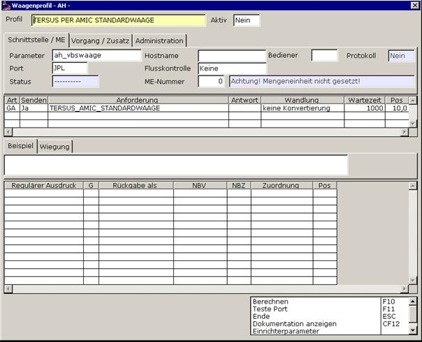
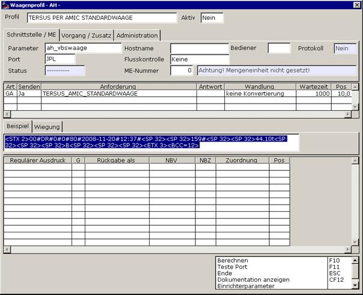
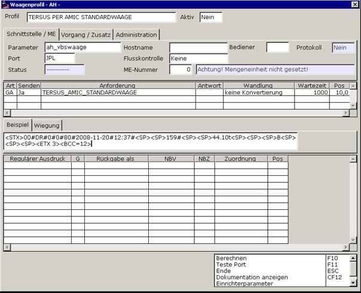
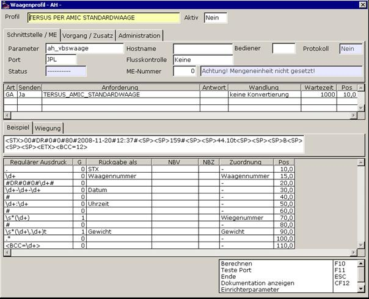
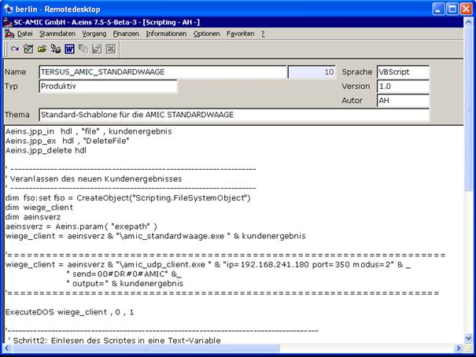

# Integration des AMIC UDP-Client als Anwendung der AMIC-Standardwaage

<!-- source: https://amic.de/hilfe/integrationdesamicudpclientals.htm -->

**Es wird die Verwendung dieses Clienten nicht länger empfohlen. Bitte stellen Sie wenn möglich auf** [**Aeinswiege**](../waagenterminals/standardwaagenprofil_unterstuetzung_aeinswiege.md) **um!**

In einem ersten Schritt legt man sich das Arbeitsgerüst des Waagenprofils an, das wie folgt aussieht:

Die Beispiel-Wiegung des AMIC-UDP_Clieneten lässt sich hervorragend dafür verwenden die nachfolgende Auswertung des Wertestrings in A.eins verwenden und kann einfach durch markieren im Clienten und mit Copy und Paste zunächst in das Beispiel-Feld übertragen werden:

Für die direkte Verwendung muss nun noch die Steuerzeichen-Sequenzen um ihre numerische Anreicherung erleichtert werden:

Daraufhin erfolgt die inhaltliche Zuordnung und Sicherstellung das es sich um einen gültigen Wiegestring handelt:

Als letzter Schritt muss eine Ableitung des Scriptes AMIC_STANDARDWAAGE gebildet werden. Der Name dafür sollte wie oben vorgesehen TERSUS_AMIC_STANDARDWAAGE sein.

Der Bereich zwischen den Gleichheitszeichen ist der einzige der angepasst werden muss.

Er sorgt im Wesentlichen für den geeigneten Parameter-Aufruf von AMIC_UDP_CLIENT.exe

Nun wird das System bei einer Testwiegung, oder aus der WAM-Auswahlliste heraus per „Probewiegung“ in der Lage sein ein Ergebnis zu liefern.

Anmerkung:

So wie sich das System jetzt darstellt, ist es in folgenden Szenarien einsetzbar:

dedizierter Einzelplatz

Punkt 1 impliziert dedizierten Terminalservereinsatz

Da der DISOMAT Tersus in der Konfiguration eine feste IP-Adresse hinterlegt und sich damit auf einen festen Kommunikationspartner beschränkt ist das vorliegende System nicht ohne weiteres direkt einsetzbar in Citrix-Load-Balancing – Systemen. Dort müsste die Verwendung auf einen Terminalserver fest vorgegeben werden. Des Weiteren ist der Einsatz also insbesondere nicht mehrplatzplatzfähig.

AMIC hat aber inzwischen Mittel und Wege auch diese beiden Handicaps softwaretechnisch zu lösen. ( AMIC – Waagenclient/Waagenserver – System )
