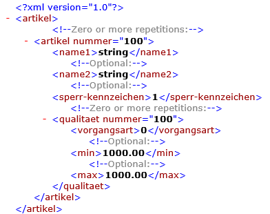

# Bitzer Artikeldaten

<!-- source: https://amic.de/hilfe/_bitzer_artikeldaten.htm -->

Folgende XML Struktur wird vom A.eins System aus mit den Daten des Artikelstamms gefüllt.

Die hier angefügten Qualitäten werden aus der Bestandteil Abteilung des Artikelstamms gelesen. Min und Max Werte sind in dem Bestandteilbereich pflegbar

