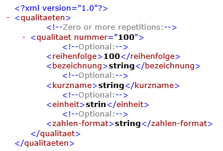

# Bitzer Qualitäten

<!-- source: https://amic.de/hilfe/_bitzer_qualitaeten.htm -->

Folgende XML Struktur wird vom A.eins System aus mit den Daten des [Bestandteilstamms](../../artikelstamm_und_artikel/parameter_des_artikelstamms/registerkarte_konstanten.md) gefüllt.

