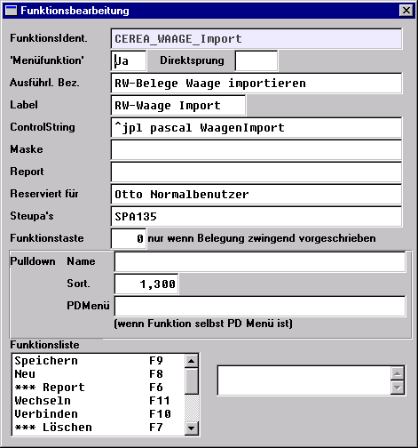
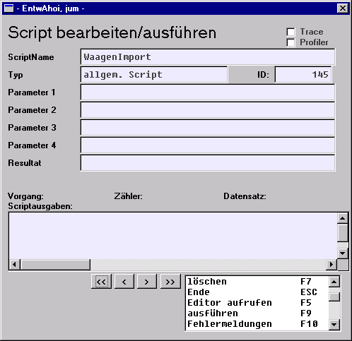
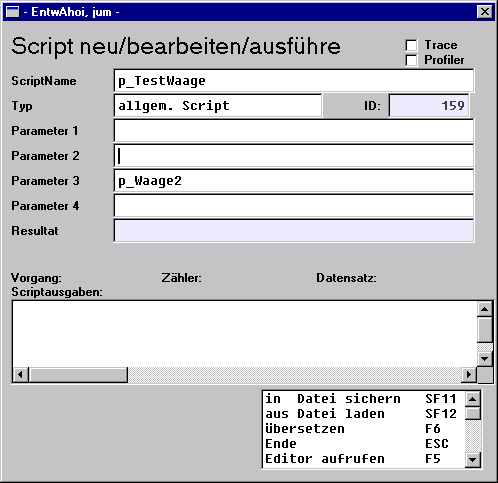

# Aufruf-Parameter

<!-- source: https://amic.de/hilfe/aufrufparameter.htm -->

Das Pascal-Script der Waagen-Schnittstelle kann mit 3 Aufruf-Parametern gestartet werden. Alle Parameter sind optional und haben folgende Bedeutung:

**Parameter 1:** Pfad und Dateiname der Waagen-Datei. Wenn hier nichts angegeben ist, wird "WAAGE.DAT" als Default angenommen. Ist der Parameter belegt, so wird sogar die Einstellung des Parameters MULTI_FILES=1 übersteuert.

**Beispiel:** WAAGE.TXT

**Parameter 2:** Lager - falls in den ASCII-Daten kein Lager gelesen werden kann, oder Lager=0, dann wird das Lager aus Parameter 2 verwendet. Ist auch dort kein Lager angegeben, so wird das Lager herangezogen, das

im Parameter DEFAULT_LAGER steht.

Beispiel: 1

**Parameter 3:** SCRIPTPID – Defaultmäßig gilt SCRIPTPID="WaagenImport". Im 3. Parameter kann für den Fall, dass mehrere verschiedene Importverfahren benötigt werden, eine andere Kennung für die ScriptParameter angegeben werden, die sich dann im allgemeinen auf eine private Gruppe von ScriptParametern beziehen.

**Beispiel:** p_WaagenImport2

Anmerkung:

Ist ein Parameter mit 0 belegt, wird er als leer interpretiert. Auf die Übergabe von Leerstrings in der Form „“ sollte unbedingt verzichtet werden, wenn das Skript aus einer Anwendfunktion heraus aufgerufen wird, da es hier zu unerwünschten Ergebnissen kommen kann.

Pascal-Scripte können im wesentlichen auf 2 verschiedenen Wegen gestartet werden

Start mit einer Anwendfunktion:

Der ControlString kann auch die 3 Parameter aufnehmen und hat dann z. B. folgendes Aussehen:

**Beispiel:** ^jpl pascal p_WaagenImport 0 0 p_Waage2

Die Nullen werden vom Skript speziell so interpretiert, daß die betreffenden Parameter 1 und 2 leer sind und lediglich Parameter 3 einen Inhalt besitzt.

Start über Makro-Funktion (Direktsprung [MAKRO])

Der parametrisierte Aufruf kann dann in folgender Weise erfolgen:

Der Start eines Scriptes erfolgt dann jeweils mit F9.
