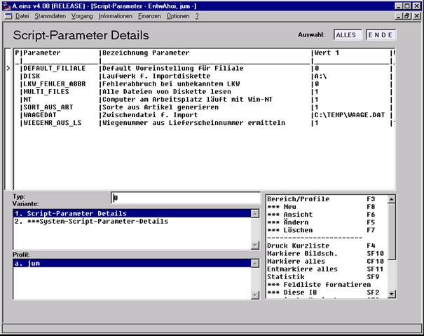

# Auswahlliste ScriptParameterDetails

<!-- source: https://amic.de/hilfe/auswahllistescriptparameterdet.htm -->

Die Auswahlliste *ScriptParameterDetails* zeigt die Detailsätze der Scriptparameter zu einem markierten Kopfsatz an. Die Anzeige erfolgt getrennt nach Typ der Parameter. Folgende Parametertypen sind z. Zt. vorgesehen:

0: allgemeine Parameter

1: Konvertierungsparameter

2: Positionsparameter

Dieser Parametertypen werden in Zusammenhang mit dem Pfleger (weiter unten) erläutert.

Jeder Datensatz repräsentiert einen Parameter. Genau genommen können bis zu 3 Werte und zusätzlich ein Gültigkeitskennzeichen (Aktiv) aus einem Datensatz gewonnen werden. Je nach Typ eines Datensatzes haben die 3 Werte konventionsmäßig unterschiedliche Bedeutung, dazu Näheres weiter unten.

Die **Option-Box** stellt folgende Funktionalitäten bereit:

Aufruf des **Pflegers** zur Neuerfassung, Änderung, Ansicht und Löschung von Detailsätzen

  

Im Kopfteil werden Informationen aus dem Kopfsatz angezeigt (nicht änderbar).

<strong>PPId:</strong> Id des Detailsatzes. Hier ist eine Eindeutige Kurzbezeichnung anzugeben anhand derer der Datensatz von einem Script aus angesprochen werden kann.

<strong>PPBezeichnung:</strong> Eine Klartextbeschreibung des Parameters
