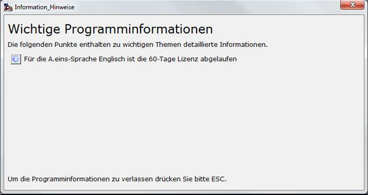

# Programmhinweise

<!-- source: https://amic.de/hilfe/_programmhinweise.htm -->

Dieser Bildschirm erscheint nach dem Anmelden an A.eins, wenn für den Anwender noch ungelesene Informationen existieren.

Durch Klicken auf das Informationsicon (Priorität Normal) oder das Achtungsicon (Priorität hoch) vor dem Informationstext gelangt man in die zugeordnete Hilfe. Wenn man die Hilfe gelesen hat – also auf das Icon geklickt hat – erscheint hinter der Zeile die Abfrage „Gelesen?“. Um die Information oder der Hinweis beim nächsten Programmstart nicht mehr angezeigt zu bekommen, setzt man hier einen Haken.
