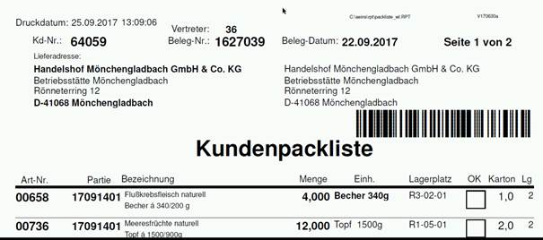
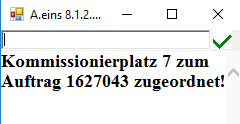
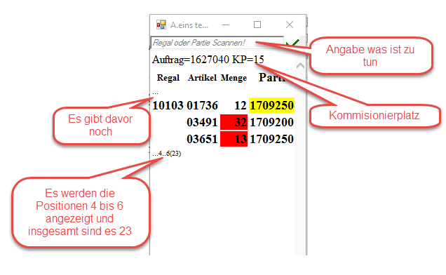
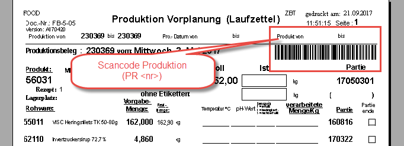
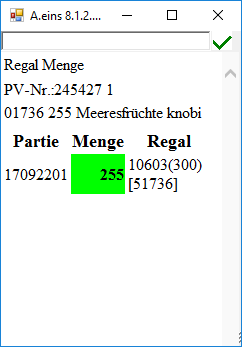
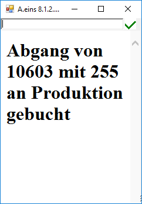

# Aufträge und Kommissionierplatz verknüpfen

<!-- source: https://amic.de/hilfe/auftrgeundkommissionierplatzve.htm -->

Möchte man einen Auftrag mit einem Kommissionierplatz verknüpfen, scanne den Barcode der Kunden-Packliste (siehe unten)

Danach scanne den Kommissionierplatz. Damit ist die Verknüpfung vom Auftrag zum Kommissionierplatz geschaffen worden.

**Farbbedeutung:**

| Menge | Partie | Regal | Artikel | Bedeutung |
| --- | --- | --- | --- | --- |
| rot | | leer | | Nicht im Lager |
| rot | | 0 | | Für den Auftrag nicht genügend vorhanden |
| weiß | weiß | | | Kann aus dem Regal geholt werden |
| weiß | gelb | | | Andere Partie als im Auftrag |
| magenta | | | | Nichts von diesem Artikel im Lager |

### Verknüpfung von Auftrag und Lagerplatz aufheben

Durch Scannen eines Regalplatzes und anschließender Eingabe von „9999“ kann die Verbindung von Regalplatz und Auftrag aufgehoben werden.

### Automatische Zuordnung von Auftrag und Regalplatz

Durch Scannen eines Auftrages und anschließendem Betätigen der Taste „F2“ wird dem Auftrag der höchste noch freie Regalplatz zugeordnet.

Zur Produktionsvorplanung müssen einige Artikel aus dem Lager zur Produktion bereitgestellt werden. Dazu gibt man im Scanner die Produktionsnummer ein oder scannt den Barcode auf dem Vorplanungslaufzettel:

****

Nach der Scannung erscheint folgendes Bild auf dem Scanner, wenn die Komponenten dieser Produktion folgende Bedingungen erfüllt:

1. Es dürfen keine halbfertige Komponenten enthalten sein

2. Sie müssen Partiezuordnungen mit einer 8 – stellige Partienummer haben

3. Die Komponenten müssen im Lager vorrätig sein

4. Nicht genügend Ware im Vorplanungsregal liegt

Die für die Produktion benötigte Menge ist grün hinterlegt. Zusätzlich zur Regalnummer wird unter Regal in der runden Klammer die im Regal vorhandene Menge angezeigt, in der eckigen wird die Artikelnummer abgebildet. Scannt man nun die Regalnummer und gibt die Entnahmemenge ein, ist in dem Scanner dann folgendes zu sehen:

