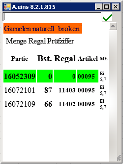
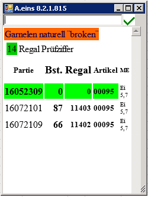
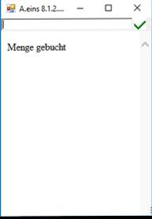
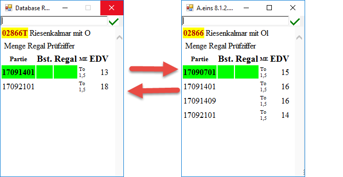
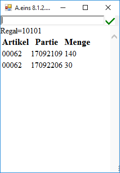

# Inventurerfassung im Lager

<!-- source: https://amic.de/hilfe/inventurerfassungimlager.htm -->

Bei der Lagerplatzkennzeichnung kann es folgende Warenauszeichnungen geben:

- Waren - EAN auf der Ware
- Karton – EAN auf dem Karton(GS1-Code128)
- Partiekennung am Karton / Ware
- Artikelnummer

### Zuordnung von Lagerplätzen

Das Addon-Feld „Lagerplatz“ wird beim Scannen des Artikels und des Regals automatisch aufgefüllt, wenn dieser unterschiedlich ist.

### Artikeleingabe

Im folgenden Beispiel gehen wir davon aus, dass die Artikelnummer in einer Länge von 5 bis 8 Stellen vorliegt. Die Kennzeichnung einer Partie wird über die Partieidentifikation als Code128 Barcode dargestellt (als Precode den Textkürzel PID), die Karton als GS1-Code128 oder Warenkennzeichnung als EAN 13.

Wird die Artikelnummer „00095“ im Scanner eingegeben, so wird der aktuelle Bestand im Lager gezeigt:

Hier ist zu erkennen, dass die Partie 16052309 produziert worden ist, aber keine Menge dieser Partie in ein Regal „verbracht“ worden ist. Die Partie 16072101 ist im Regal 11403 mit 87 Eimern eingelagert

Per Pfeiltaste kann zwischen den einzelnen Partien gewechselt werden. Wird nun im obigen Fall die Menge der einzulagernden Ware angegeben, so erscheint folgendes Informationsbild:

 

Es ist hierbei eine Menge von 14 Eimern angegeben worden, alternativ kann auch ein 4.2 angegeben werden, für 4 Kartons plus 2 Becher (das Zeichen „.“ ist auf der Scannertastatur besser zu erreichen als eine Leertaste, deshalb wird zwischen Kartons und Eimern als Trennzeichen der Punkt genutzt).

In der zweiten Zeile ist jetzt noch angegeben, dass noch das Regal zu „Scannen“ oder einzugeben (Beachte: „R Regalnummer“) sowie die regalspezifische Prüfziffer. Nach Scannung des Regals und Eingabe der Prüfziffer, die am Regal vermerkt ist, sieht die Buchung dann wie folgt aus:

Lager leeren

Soll ein Lagerfach komplett geleert werden, muss die Menge 0 des Artkels gebucht werden.

Kommt die Partienummer zu dem Artikel in der Liste nicht vor, gibt man die 8-stellige Partienummer ein.

Weiterer Artikel

Gibt es einen weiteren Artikel der gleichen Art z.B.02866**T** kann man mit den Pfeiltasten nach links und rechts zwischen den Artikeln hin und her blättern.

****

### Karton scannen

Wird der GS1- Code128 am Karton gescannt, wird der Artikel und die Partie ermittelt. Wird die Partienummer erkannt, wird diese grün markiert. Bei Nichterkennen der Partienummer wird die erste Partie markiert.

### Regal scannen

Mit der Regalscannung kann man ermitteln, welche einzelnen Partien in einem Regalfach vorhanden sind.

Wird ein Kommissionier-Regal gescannt, wie der zugehörige Auftrag angezeigt:

**Hinweis**

Die als Kommissionierplätze gekennzeichneten Regale (siehe auch Regaltyp) sind genauso per Inventur bebuchbar, wie all die anderen Regalplätze. Hier gilt aber folgende Regel:

Ist ein Kommissionierplatz zu einem Auftrag zugeordnet (siehe auch [Aufträge und Kommissionierplatz verknüpfen](./auftraege_und_kommissionierplatz_verknuepfen.md) ) und wird/ist der Kommissionierplatz wieder geleert worden, der Auftrag aber als fertig Kommisioniert zugeordnet, dann wird automatisch beim Scannen des Auftrages (AUB &lt;nr>) das Kommissionierkennzeichen (LKW_NummerAnhaeng=1) zurückgesetzt, damit der Auftrag neu zugeordnet werden kann.
