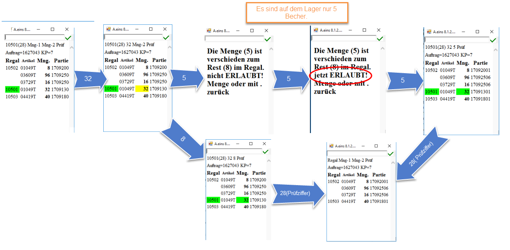
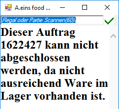
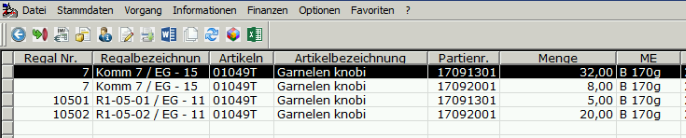
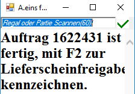
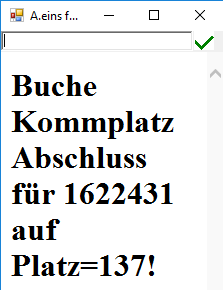
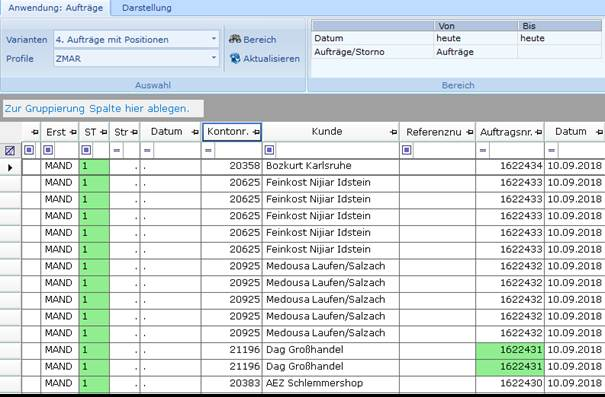

# Kommission aus Lager

<!-- source: https://amic.de/hilfe/kommissionauslager.htm -->

Scanne den Auftrag (siehe Aufträge und Kommissionierplatz verknüpfen), der kommissioniert werden soll. Anschließend scanne den Regalplatz, wird dieser grün angezeigt, stimmt gewünschter Artikel und angegebene Partie überein. Nach Eingabe der zu entnehmenden Menge wird die Menge gelb unterlegt Als nächstes wird die im Regal verbleibende Restmenge eingegeben. Stimmt die gezählte Restmenge mit der Menge im System überein, wird die Menge grün. Ist das nicht der Fall wird eine Fehlermeldung ausgegeben, in der die Menge aus dem System erscheint. Hat man die Restmenge im Regal geprüft und gibt die ermittelte Menge erneut ein, wird diese als korrekte Restmenge akzeptiert und gebucht. Die Fehlmenge wird im Fehlmengenregal des Benutzers gebucht. Nach Eingabe der Prüfziffer verschwindet die Zeile aus dem Auftrag, da dieser Artikel nun kommissioniert ist. Unten ist der Ablauf grafisch beschrieben:

Wenn nicht genügt Ware für den Auftrag im Lager vorhanden ist, so erscheint folgende Anzeige:

Im System sieht es dann folgendermaßen aus:

Hinzu kommt dann noch die Liste der Fehlmengen des Benutzers:

Die Fehlmengenliste wird regelmäßig geleert.

### Auftragsfreigabe zum Lieferschein

Sind alle Artikel im Auftrag vollständig kommisioniert (richtige Partie und vollständige Menge), so kann eine Lieferscheinfreigabe erfolgen (siehe Bild).

Mit der Taste „F2“ wird ein Lieferschein erzeugt. Es erscheint folgende Anzeige:

In der Anwendung „Auftragsbearbeitung“ in der Variante „Aufträge mit Positionen“ wird bei dem entsprechenden Auftrag, die Auftragsnummer grün unterlegt.

