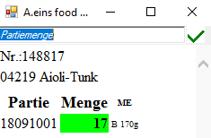
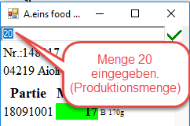
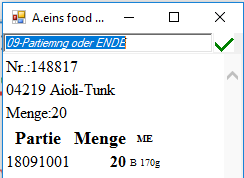
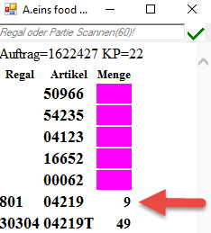
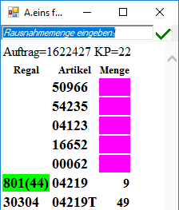
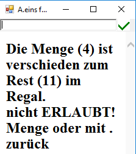
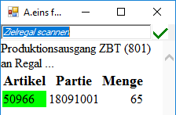
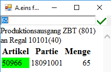

# Produktion

<!-- source: https://amic.de/hilfe/produktion2.htm -->

Scanne Produktionslaufzettel.

Und es erscheint auf dem Scanner folgend Anzeige:

Die produzierte Menge eingeben.

Eingabe mit der Taste „ENT“ bestätigen. Danach erscheint folgende Anzeige:

Entweder kann jetzt der Ende-Code gescannt (vom Produktionszettel) werden oder es kann eine weitere Menge für eine Partie eingegeben werden.

Nach dem Scannen des Ende-Codes werden nacheinander alle Aufträge und der dazugehörige Kommisionierplätze für diesen Artikel angezeigt.

Das entsprechende Regal scannen und es erscheint folgende Anzeige:

Die aus dem Regal 801 (Palette aus der Produktion) entnommene Menge eingeben und mit der Taste „ENT“ bestätigen. Anschließend die verbleibende Restmenge auf Regal 801 eingeben und mit der Taste „ENT“ bestätigen.

Wird eine falsche Restmenge eingegeben erscheint folgende Anzeige:

Die vorhandene Restmenge ist erneut einzugeben. Danach erscheint eine Aufforderung zum Eingeben der Prüfziffer des Regals. Anschließend erscheint folgende Anzeige:

Es ist das Zielregal für die vorhandene Restmenge einzugeben. Danach ist die Umbuchungsmenge einzugeben. Abschließend ist die Prüfziffer des Zielregals einzugeben.

Jetzt kann die nächste Produktion verarbeitet werden.
