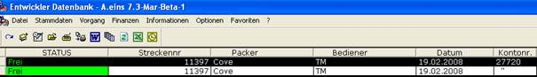

# Aufträge (Teildisponierung, Strecke)

<!-- source: https://amic.de/hilfe/_cescannerteildispo.htm -->

| Vorgangsfunktions Übersicht |
| --- |
| Starten der Teildisponierung |
| Daten einscannen |
| Beenden der Teildisponierung |

| Erklärung der Kopfzeilen |
| --- |
| Die erste Zeile im Kopftext zeigt die Auftragsnummer an. |
| Die zweite Zeile im Kopftext zeigt die Artikelstammbezeichnung an. |
| Die dritte Zeile im Kopftext zeigt die benötigte Gesamtmenge und die eingegebene Menge an. |

Diese Funktion erlaubt mehrere Aufträge, die zu einem Kunden gehören zu klammern und als einen Auftrag abzuarbeiten. Es können auch einzelne Positionen aus verschiedenen Aufträgen zu einer Klammer zusammengefasst werden. Dieser Auftrag kann dann über den Online Scanner abgearbeitet werden. Nach erfolgreicher Bearbeitung erstellt der Mandanten Server einen Lieferschein aus dem geklammerten Auftrag.

Es sind aber noch ein paar Einstellungen im Aeins vorzunehmen. Unter [FRZ] kann für die Klasse und die Unterklasse eingestellt werden, ob die Klammernummer gleich der Belegnummer ist. Wird diese nicht angegeben, so erhält die Klammernummer den Default Wert von 0. Um einen Auftrag oder Positionen eines Auftrages Klammernummer zuzuordnen, gehen Sie bitte unter [AUB] in die Variante „Aufträge mit Position“. Unter dem Direktsprung [Forma] muss das Format af_klstatus gefüllt werden. Es gibt bislang 7 unterschiedliche Status.

| Status | Wann |
| --- | --- |
| 1 | Wenn der Auftrag neu erfasst worden ist. |
| 2 | Nach der Zuweisung der Klammernummer |
| 3 | In Bearbeitung |
| 4 | Wenn die Auftragsabarbeitung auf einen Fehler gelaufen ist. |
| 5 | Wenn der Lieferschein in Erstellung ist |
| 6 | Wenn der Lieferschein automatisch gedruckt wurde |
| 7 | Wenn der Lieferschein unterschrieben im Formular Archiv liegt |

Die unterschiedlichen Werte des Status werden farblich in der Auswahlliste dargestellt.

Hier können einzelne Positionen einer oder mehrerer Aufträge ausgewählt werden. Dann klicken Sie auf „Streckennummer zuordnen“. Jetzt öffnet sich die Pfleger Maske für die Klammer.

In dieser Maske können dann die Daten eingegeben werden, die für die Klammer benötigt werden. Ist die Klammervorbelegung unter [FRZ] eingerichtet, so wird die Klammernummer automatisch vorbelegt. Ist die Klammervorbelegung nicht eingerichtet, so wird eine neue Klammernummer eingetragen. Unter Bezeichnung kann der Klammernummer eine Bezeichnung gegeben werden. Das Feld Bediener füllt sich automatisch mit dem Erfasser. Als Packer kann der Lagermitarbeiter eingetragen werden.

Ist eine Klammernummer zugewiesen worden, so muss danach der Auftragszettel ausgedruckt werden. Dazu markieren Sie bitte den entsprechenden Datensatz und klicken dann auf Auftragsliste Drucken. Jetzt wird Ihnen eine Liste mit allen Positionen ausgedruckt. Die Liste kann jetzt abgearbeitet werden.

Die Reihenfolge der Abarbeitung:

Als erstes wird der Code von dem Zettel gescannt der mit “AT “ beginnt. Jetzt erscheinen auf der Scanner Maske im oberen Bereich Daten zu dieser Auftragsliste und dem gescannten Artikel. Unten in der AnzeigeBox werden alle weiteren Positionen der Auftragsliste angezeigt.

Die IB_Box die die Anzeige steuert heißt „IB_CE_TeilVorgang“. Durch eine private Ableitung der IB_Box ist es möglich Einfluss auf die angezeigten Daten zunehmen.

Als nächstes wird der Code des zu beladenden Artikels gescannt. Die Menge wird in der Grundeinheit der Ware angegeben.

Ist die Ware partieabhängig, so kann unter [FRZ] auf der Registerkarte „Partie“ in das Feld „DB-Procedure für MDE Sperre“ eine private Prozedur eingetragen werden. Diese entscheidet ob die gescannte Partie gesperrt ist oder nicht. Die private Prozedur muss eine 1 für gesperrt und eine 0 für nicht gesperrt zurückgeben. Ist eine Partie gesperrt, so wird die ganze aktuelle Position gelöscht. Ein Beispiel für die private Prozedur finden Sie im Technischen Umfeld dieser Scanner Hilfe.

Ist eine Position oder Ware falsch eingescannt worden, so kann man über den Scan-Code „ATSTORNO“, der unten links auf dem Zettel zu finden ist, die letzte Position komplett löschen.

Ist Ware einmal nicht vorhanden, so kann durch zweimaliges Scannen des Befehls ATENDE der Vorgang abgeschlossen werden.

Durch das Abscannen des Befehles ATPRINT ist es möglich, den erstellten Lieferschein sofort auszudrucken.

Achtung: Dem Scanner Benutzer muss ein Drucker zugeordnet worden sein.
