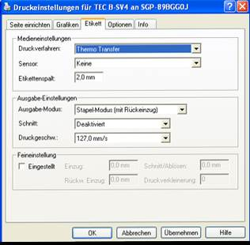

# ET Etikettendruck

<!-- source: https://amic.de/hilfe/_cescanneretikett.htm -->

Um ein Etikett zu erstellen welches dann diesen Sofort druck auslöst, bitte den Direktsprung auf sctcp benutzen, dort finden Sie Scanner Etikett Bearbeiten und Scanner Etikett Druck. Beide Funktionen greifen auf den AMIC Etikettendruck zurück. Unter dem Direktsprung ETIDR finden Sie eine Funktion die „Scanner_etikett“ heißt. Diese Stellt das Etikett zum Drucken über den aus. Des Weiteren gibt es dort die Funktion „Scanner druck“ diese Funktion ist dafür zuständig, dass die Gewünschte Seite ausgedruckt wird. Nach der Anwahl der Funktion und das Auswählen zum Bearbeiten. Unter dem Prozedurname und Funktion zum Aufrufen geben Sie bitte die Relation an. Dann klicken Sie bitte auf „Reportbearbeiten“ Taste „F6“ und können dort die Seite Ihren Wünschen anpassen. Beim Scancode ET können über den Scanner direkt Druckbefehle ausgeführt werden

**Wie wird ein Etikett unter dem AMIC Etikettendruck eingerichtet und gedruckt**.

Beispiel Drucker TEC – B – SV4 Label Drucker

Wird ein neues Etikett erstellt, so wird als erstes in der Drucker Software die Etikett Größe Eingestellt. Klicken Sie auf neues Etikett und geben dort als Name z.B. „Etikett Labor Eingang“ Dort finden wir bei unserem Beispiel Drucker den Tabreiter Seite einrichten. Jetzt richten wir die Breite und Länge einer Seite ein. Auch wenn auf der Etikettenrolle zwei Etiketten zu bedrucken sind, so wird die gesamte Breite des Etikettes angegeben. Die Höhe ist die gesamte Höhe von dem unteren Rand des Etiketts bis zum nächsten unteren Rand des nächsten Etiketts. Des Weiteren kann der noch der nichtdruckbare Bereich angegeben werden. In unsere Beispiel:

| Seiten | Bedeutung |
| --- | --- |
| Breite(a) | Breite des gesamten Etiketts mit nicht druckbaren Bereich |
| Höhe(b) | Abstand zwischen zwei unterkanten von zwei Etiketten |
| Links(c) | Größe des nicht Druckbaren Bereiches von links aus gesehen |
| Rechts(d) | Größe des nicht Druckbaren Bereiches von rechts aus gesehen |

Dann klicken Sie auf den Reiter Etikett und wählen dann dort Thermo Transfer wenn Sie Etiketten mit Thermo Papier bedrucken wollen, oder Thermo Direkt wenn Sie Thermo Etiketten haben. Bei Thermo Transfer ist darauf zu achten, dass unter Optionen der Rückspulmotor auf -1 zusetzten ist, weil der Drucker sonst das Thermo Papier nicht aufspult.

Nachdem das Etikett in der Druckersoftware eingerichtet worden ist, können wir nun das Etikett unter dem AMIC Etikettendruck einrichten.

