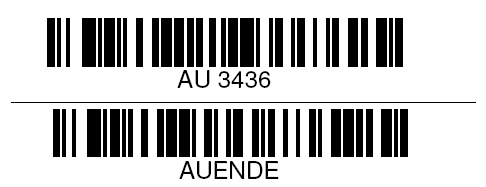
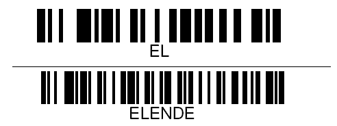

# Beispiel Scancodes

<!-- source: https://amic.de/hilfe/_cescannerbeiscancodes.htm -->

Hier finden Sie Beispiel Scancodes für die Implementierten Funktionen.

Scancode für einen Auftrag(Kommissionierung)

Scancode für einen Eingangslieferschein

Scancode für die Inventur

