# Beispiel einer eigenen Anwendung

<!-- source: https://amic.de/hilfe/beispieleinereigenenanwendung.htm -->

Hier wird gezeigt, wie eine private Tabelle in A.eins mit AIS gepflegt werden kann. Als Beispiel wird eine manuelle Bestandsmeldung von Lägern an die Zentrale gewählt.

Zum Anlegen der privaten Tabelle benutzt man den üblichen Datenbankbefehl.

```sql
Create table admin.P_Bestand
( Ident integer not null,
  Datum date,
  Lager integer default 0,
  Artikel char(16),
  Bestand numeric ( 30,4 ) default 0.00,
  Bemerkung char(64),
  Bediener char(16) default current user,
  Zeitstempel timestamp default current timestamp,
  primary key ( Ident ) ) ;
```

Der Befehl kann über OSQL direkt eingegeben oder als ASQL gespeichert und dann ausgeführt werden.

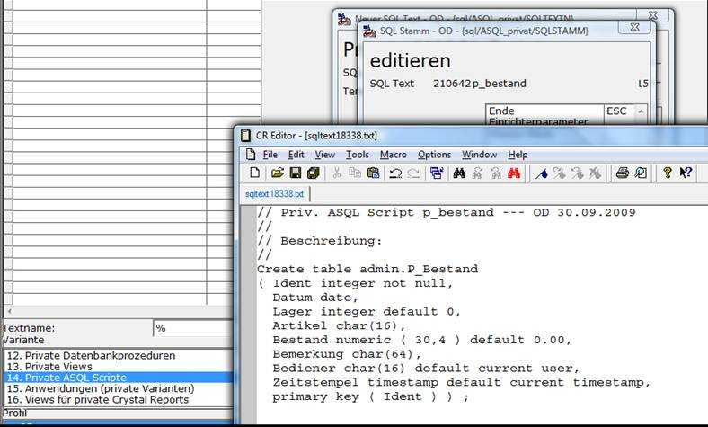

Wählt man diese Form der Tabellenanlage so erkennt AIS die Eingabefelder als existent und belässt sie in der Tabelle.

Legt man die Eingabefelder ( Datum, Lager, Artikel, Bestand, Bemerkung ) nicht mit create an, so werden sie von AIS angelegt

Zusätzlich ist es notwendig, einen Eintrag in der Tabelle Ident vorzunehmen. Aus dieser Tabelle werden bei Neuerfassung die Werte für den Primary Key gelesen.

```sql
insert into ident
 ( IdentTableName, IdentColumnName, IdentIdent, IdentAktivKont, IdentAngefKont)
  Values
 ( 'p_bestand', 'Ident', 0, 1, 0)
```

A.eins muss einmal verlassen und neu gestartet werden, damit dieser neue Eintrag zur Verfügung steht.

#### Einbinden in A.eins

Private Variante unter Private Anwendung **[PRANW]**

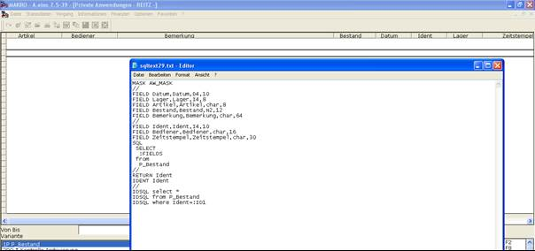

Mit Privater Option Box (P_OB )

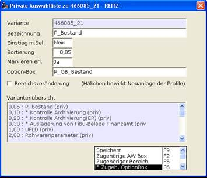

In die Option Box fügt man üblicherweise die private Funktion für Selektion (**F2**) ein.

#### Menüpunkt einrichten

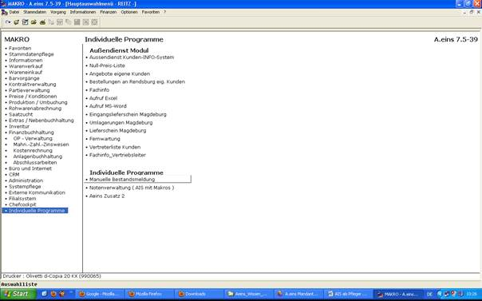

Der Menüpunkt „***Manuelle Bestandsmeldung***“ wurde wie üblich als Private Funktion (Direktsprung **[PF]**) angelegt und mit dem Menü „***Individuelle Programme***“ (73) verbunden, einsortiert und geschützt.

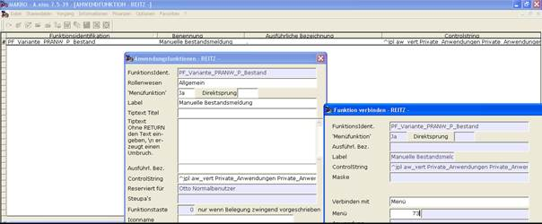

Der vollständige Controlstring lautet hier:

```text
^jpl aw_vert Private_Anwendungen Private_Anwendungen Private_Anwendungen 466085_21
```

In der Variante 1 zu AIS muss zunächst mindestens ein Feld der Gruppe angelegt werden. Wir bauen hier z.B. eine bunte, große Überschrift.

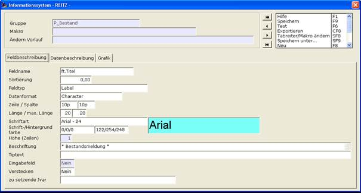

Die Variante 3 unter AIS ermöglicht es die Maske festzulegen, auf die die Felder der Gruppe platziert werden.

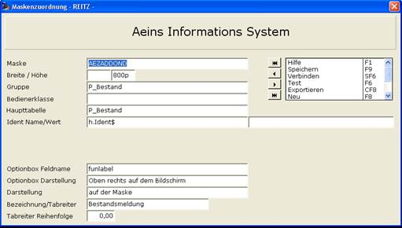 

Nun kann die Funktion „Verbinden“ genutzt werden

 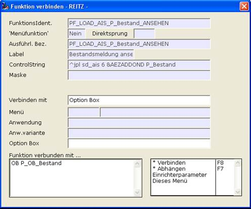

AIS legt automatisch zwei private Funktionen an:

- ***Ändern* F5**
- ***Ansehen* F6**

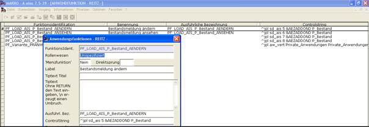

Da wir einen eigenständigen Pfleger bauen wollen, fehlen noch 2 Punkte:  
    

- ***Löschen* F7**
- ***Neu* F8**

Diese Funktionen müssen über den Direktsprung PF (Private Funktionen) manuell angelegt werden.

**ACHTUNG:**

<strong><em>F7</em></strong><em> und <strong>F8</strong> dürfen nur dann verwendet werden, wenn man nur seine eigenen Daten pflegt. </em>

Sobald man auf Systemtabellen von A.eins zugreift (Einbindung als eigenständiger Pfleger mit Verweis auf eine bestehende Ident.), ist LOESCHEN und NEU verboten, da dann auch die Systemtabelle gelöscht werden würde.

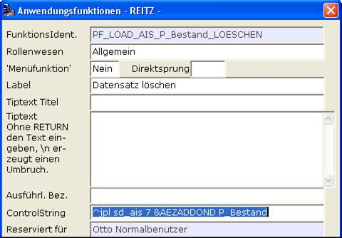

Die Funktion **sd_ais** ermöglicht es also die 4 üblichen Bearbeitungspunkte **F5, F6, F7** und **F8** zu nutzen.

Das vollständige Ergebnis kann dann wie folgt aussehen:

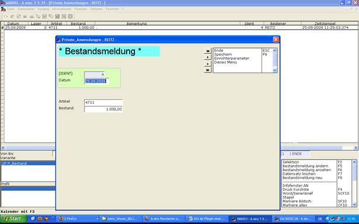
