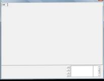
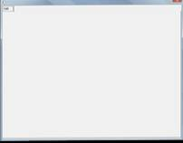
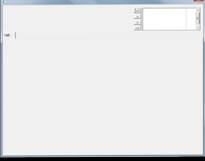
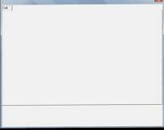
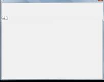
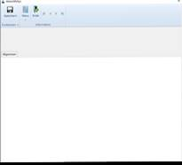
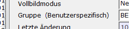

# Maskenzuordnung

<!-- source: https://amic.de/hilfe/maskenzuordnung.htm -->

Hauptmenü > Administration > Werkzeuge > Informationssystem > Variante „Maskenzuordnung“

Direktsprung **[AIS]**

Bei der Zuordnung der erstellten Gruppen zu den Masken gibt es prinzipiell vier verschieden Arten:

1. Zuordnung zu bestehenden Masken als zusätzlichen Informationsbereich. Hier sind z.B. die Konteninformation bzw. OP-Verwaltung zu nennen. Hier kann AIS nur zur Anzeige benutzt werden. Will man hier Daten speichern, so muss dies selbstständig programmiert werden.

2. Zuordnung zu bestehenden Stammdatenpflegern zur Neuerfassung/Änderung.

3. Einbindung als eigenständiger Stammdatenpfleger mit Zuweisung einer eigenen Ident.

4. Einbindung als eigenständiger Pfleger mit Verweis auf eine bestehende Ident.

Bei der Zuordnung zu bestehenden Masken ( 1. und 2. ) können bis zu vier Identfelder zugeordnet werden. Dies ist ggf. dann notwendig, wenn der eindeutige Schlüssel aus mehr als einem Feld besteht.

Man kann einer Maske grundsätzlich mehrere Gruppen zuordnen.

### Maske

Welcher Maske soll diese Gruppe zugeordnet werden? Dies kann ein existierender Stammdatenpfleger sein. Den Maskennamen eines Stammdatenpflegers erhält man durch Drücken von **shift+strg+F5** auf der entsprechenden Maske. Im Kundenstamm lautet der Name der Maske z.B. TBKUNSTB.  
Soll es ein eigenständiger Pfleger werden, so stehen hier die Masken AEZADDON oder AEZADDOND sowie die Masken AEZADDONT1 bis AEZADDONT22, bei denen Register verwendet werden können, zur Verfügung. Die Maske AEZADDOND unterscheidet sich nicht von AEZADDON. Bei diesen eigenständigen Stammdatenpflegern kann nur eine Ident Name/Wert erfasst werden. Der Name wird mit h.Ident$ vorbelegt.

Die Masken AEZADDON(D) und AEZADDON**T** unterscheiden sich inhaltlich dadurch, dass bei der Maske AEZADDON(D) immer nur eine Gruppe dargestellt wird und bei den Masken AEZADDONT1 bis 22 jeweils alle unter der Maskenzuordnung angegebenen Gruppen gleichzeitig dargestellt werden.

### Vollbildmodus

Hier wird eingestellt, ob die Maske im Vollbildmodus oder im Dialogmodus geöffnet wird. Wird hier ein **Ja** eingetragen, so ist es nicht möglich Breit und Höhe anzugeben, oder die Optionbox zu positionieren. Diese Option steht nur für die Masken AEZADDON / AEZADDOND / AEZADDONT… zur Verfügung. Setzt man für die Masken AEZADDONT1 bis 22 den Vollbildmodus, so wird das Register dann automatisch auf die gesamte Bildschirmgröße gesetzt, wenn gleichzeitig die Optionbox-Darstellung auf „….Tabreiter vergrößern“ steht.

### Breite / Höhe

Wenn der Maskenname AEZADDON / AEZADDOND / AEZADDONT… lautet, kann man hier die Größe der Maske festlegen. Die Standardgröße ist 800 (Breite) \* 600(Höhe) Pixel. Wenn man diese Werte ändert, muss man die Positionierung der Optionbox beachten, sie also gegebenenfalls ausblenden oder die Position rechts oben auf dem Bildschirm wählen.

### Gruppe

Welche Gruppe aus dem AIS soll angezeigt werden?

### Letzte Änderung

Hier wird angezeigt, wann die Gruppe das letzte Mal geändert worden ist. Dieses Datum wird immer automatisch gesetzt.

### Bedienerklasse

Man kann diese Erfassung auf bestimmte Bedienerklassen beschränken. Soll die Erfassung allen Bedienerklassen zur Verfügung stehen, so bleibt dieses Feld leer, ansonsten kann man hier eine durch Komma getrennte Liste von Bedienerklassen eintragen, die diese Gruppe sehen/bearbeiten dürfen. Stellt man dem Ganzen ein Minuszeichen vorweg, so dürfen alle Bedienerklassen bis auf die hier aufgelisteten, die Gruppe verwenden.

### Haupttabelle

Diese Haupttabelle ist dann wichtig, wenn man die Gruppe als eigenständigen Pfleger einbauen will. Es ist also dann nötig, wenn es sich um eine der AEZADDON-Masken handelt. Bei den Masken AEZADDONT1-AEZADDONT22 werden bekanntermaßen alle über die Maskenzuordnung zugewiesenen Gruppen geladen. Dies bedeutet, dass es mehrere Maskenzuordnungen gibt und somit auch mehrere Haupttabellen geben könnte. Es wird jedoch nur die erste gefundene (in der Register-Reihenfolge) verwendet.

### Ident Masken-Feldname bis Ident Masken-Feldname4

Dieser Name ist wichtig für die Zuordnung der Gruppe zu dem bestehenden Pfleger bzw. zur eindeutigen Identifikation. Der Wert dieses Maskenfeldes versorgt den Primärschlüssel der [Relationen](./ais_einrichtung/datenbeschreibung.md) in den angehängten Gruppen. Diese bilden die Verbindung zu den auf dem Register Datenbeschreibung unter Datenherkunft angegebenen Ident-Feldern.  
Man erhält den Namen des Feldes, indem man auf der entsprechenden Maske **shift+strg+F5** drückt.

**ACHTUNG:**

*Auf Groß- und Kleinschreibung achten!*

Der Inhalt dieses Feldes wird intern in Felder mit den Namen **IDENT, IDENT2, IDENT3** und **IDENT4** übertragen, so dass sie in der Gruppe verwendet werden können. Dies hat den Vorteil, dass Gruppen auf unterschiedlichen Masken verwendet werden können, obwohl das eigentliche Identfeld unterschiedlich geschrieben ist (z.B. Groß - und Kleinschreibung). Auf dem eigenständigen Pfleger (Maske AEZADDON) lautet der Name des Feldes im Standard immer „h.Ident$“ und wird auch so vorbelegt. Gibt man bei der Maskenverarbeitung ein anderes an - z.B. h.KontoNummer$, so wird dieses verwendet. Wichtig ist bei den AEZADDON-Masken, dass der Feldname mit einem „h.“ beginnt und mit einem „$“ endet.

### Ident Wert bis Ident Wert4

Es steht im Ändernmodus bei der Maskenzuordnung die Funktion Test zur Verfügung. Diese Funktion benötigt einen Wert für die Ident Felder. Diese müssen hier eingetragen werden. Bei der Testfunktion wird dann die Maske aufgerufen und die bisher eingerichteten AIS-Felder mit angezeigt. Die Masken können nur im Testmodus geöffnet werden, wenn im Pflegerstamm (Direktsprung **[PST]**) eine Zuordnung eingetragen ist. Für die Maske AEZADDON und viele mehr existiert dieser Eintrag bereits.

### Optionbox Feldname

Wie lautet der Name des Feldes für die Optionbox(**shift+strg+F5**). Häufig heißen diese Felder funlabel oder AUSWAHL. Dieser Name ist wichtig, um gegebenenfalls die Optionbox auszublenden.

### Optionbox Darstellung

Ab und an will man Pfleger ohne ein Funktionsmenü erstellen. Oder sie soll nicht unten, sondern oben dargestellt werden. Hier legt man die gewünschte Darstellung fest. Die Optionen „Ausblenden und Register oben“ bzw. „Ausblenden und Register unten“ stehen nur bei den Masken, die mit AEZADDONT beginnen, zur Verfügung. Die Darstellungen, die mit „Eingeschränktes Mausmenü“ beginnen gelten für alle AEZADDON-Masken. „Eingeschränktes Mausmenü“ bedeutet, dass das Menü, welches über die rechte Maustaste geöffnet wird, nur die ESCAPE-Funktion enthält.

- 0 ⇨ Unten rechts auf dem Bildschirm
- 1 ⇨ Ausblenden
- 2 ⇨ Oben rechts auf dem Bildschirm
- 3 ⇨ Ausblenden und Register oben
- 4 ⇨ Ausblenden und Register unten
- 5 ⇨ Menüband (nur in der 64 Bit-Version von A.eins)
- 6 ⇨ Menüband und Register unten (nur in der 64 Bit-Version von A.eins)
- 9 ⇨ Eingeschränktes Mausmenü ausblenden
- 11 ⇨ Eingeschränktes Mausmenü Ausblenden und Register oben
- 12 ⇨ Eingeschränktes Mausmenü Ausblenden und Register unten

Die Darstellungsmöglichkeiten 3 „Ausblenden und Register oben“ und 4 „Ausblenden und Register unten“ stehen nur dann zur Verfügung, wenn man eine der Masken AEZADDONT1 bis AEZADDONT22 verwendet hat. Bei diesen Masken wird hierdurch auch die Größe bzw. die Position des Registers beeinflusst.

| Position | Beispiel |
| --- | --- |
| Unten rechts auf dem Bildschirm |  |
| Ausblenden und Register vergrößern. Das Register wird nur dann vergrößert, wenn die Größe der Maske ( Breite / Höhe ) gesetzt ist. |  |
| Oben rechts auf dem Bildschirm |  |
| Ausblenden und Register oben |  |
| Ausblenden und Register unten |  |
| Menüband Tabreiter vergrößern |  |
| Menüband und Register unten |  |

### Menü ohne Neu/Speichern unter

Nur bei Masken, die mit AEZADDON beginnen: In der Optionbox bzw. im Menüband werden diese beiden Funktionen nicht angeboten.

### Private Optionbox:

Es kann zu den Optionboxen eine eigene private Optionbox dazu gelinkt werden. Sind mehrere private Optionboxen definiert - z.B. wegen mehrerer Register - dann wird nur die zuerst gefundene Optionbox verwendet.

### Darstellung:

Hier wird festgelegt, wo auf der Maske die Gruppe dargestellt wird.

- 0 ⇨ auf der Maske
- 1 ⇨ auf dem Register eingereihte Tab-Reihenfolge
- 2 ⇨ auf dem Register alleinstehende Tab-Reihenfolge
- 5 ⇨ auf dem Pixelregister eingereihte Tab-Reihenfolge
- 6 ⇨ auf dem Pixelregister alleinstehende Tab-Reihenfolge

Die Optionen **„eingereiht“** und **„alleinstehend“** beziehen sich auf das Verhalten des Cursors. Wählt man „**eingereiht“**, so wird beim Verlassen des letzten Originalfeldes in das erste Feld auf dem AIS-Register gesprungen und beim Verlassen des letzten Feldes auf dem AIS-Register wird in das erste Feld auf dem ersten Register gesprungen. Hat man mehrere AIS-Register einer Maske zugeordnet, dann wird auch automatisch zwischen den Registern gewechselt. Bei der Darstellungsoption „**alleinstehend**“ bleibt jedes AIS-Register für sich, d.h. beim letzten Feld auf einem AIS-Register wird in das erste Feld auf demselben Register gesprungen.

Die Angabe von Pixeln und Jam-Koordinaten bei Feldern unterscheidet sich bei Registerkarten. Jam-Koordinaten beziehen sich auf die linke obere Ecke des Registers, bei Pixeln immer auf die linke obere Ecke der Maske. Wird Pixelregister verwendet, so werden die Koordinaten so umgerechnet, als ob sie auch auf die linke obere Ecke des Registers beziehen.

### Bezeichnung/Register:

Dieses Feld hat zweierlei Bedeutung:

- Wenn die Gruppe auf einem Register dargestellt werden soll, ist dies die Bezeichnung (Label) des Registers. Existiert das Register bereits, so wird die Gruppe auf dem existierenden Register dargestellt. Ansonsten wird ein neues Register mit der hier eingetragenen Überschrift erzeugt.
- Beim Verbinden dieser Gruppe ( nur bei Maske AEZADDON oder AEZADDOND ) wird die hier eingetragene Bezeichnung in dem Funktionsmenü verwendet.

### Register Reihenfolge

Wenn zu einer Maske mehrere Register zugeordnet werden, kann man hier die Reihenfolge festlegen, in der diese angelegt werden.

### Abweichender Maskentitel

Diese Option steht nur dann zur Verfügung, wenn die Maske mit AEZADDON beginnt. Hiermit kann die Titelzeile gesetzt werden. Sind mehrere Titel definiert - z.B. wegen Verwendung mehrerer Register - dann wird nur der zuerst gefunden Titel angezeigt.

### Ohne Datenzugriff

Diese Option steht nur dann zur Verfügung, wenn die Maske mit AEZADDON beginnt. Im Standard werden die Daten sofort anhand einer übergebenen ID geladen. Jetzt gibt es jedoch auch die Anforderung, dass man erst in einem Feld die einen Wert abfragen möchte und anschließend zusätzliche Daten laden will. Setzt man dieses Feld auf **Ja**, werden vorläufig keine Daten geladen und es wird auch nicht automatisch gespeichert. Siehe auch Beispiel Infoblatt.

### Automatisch Speichern?

Diese Option steht nur dann zur Verfügung, wenn die Maske mit AEZADDON beginnt und die Option „Ohne Datenzugriff“ nicht auf **Ja** steht. Steht hier ein **Ja**, so wird bei **ENTER** auf dem letzten Feld der Datensatz automatisch gespeichert. Ansonsten muss man mit **F9** die Erfassung des Datensatzes abschließen.

### Löschfunktion aktiv?

Diese Option steht nur dann zur Verfügung, wenn die Maske mit AEZADDON beginnt. Trägt man hier **Ja** ein, so hat man im Ändern-Modus gleichzeitig die Möglichkeit den Datensatz auch zu löschen. Standardvorbelegung ist **Nein**.

#### Benutzerspezifische Gruppe

Diese Funktion ermöglicht es, einzelnen Benutzer unterschiedliche Darstellungen eines Sachverhalts zuzuordnen. Die in der Maskenzuordnung festgelegte Gruppe gilt für alle Benutzer, in den benutzerspezifischen Gruppen kann man dann für ausgewählte Benutzer eine andere Gruppe hinterlegen. Für diese benutzerspezifische Gruppe gelten ansonsten alle Einstellungen so wie sie in der Maskenzuordnung hinterlegt. Diese Gruppe kann dann zum Beispiel nichts weiter als den Label „Kein Zugriff“ enthalten um die Informationen für Benutzer X zu sperren, oder sie enthält zwar dieselben Informationen, aber man hat in dieser benutzerspezifischen Gruppe dann keine Möglichkeit zum Ändern.

Sind in einer Maskenzuordnung benutzerspezifische Gruppen hinterlegt, so erscheint hinter der Bezeichnung „Gruppe“ noch in Klammernder Hinweis, dass benutzerabhängige Gruppen existieren.

#### Verbinden

Die Funktion „***Verbinden***“ steht nur dann zur Verfügung, wenn die Maske AEZADDON oder AEZADDOND heißt. Sie wird erst eingeblendet, nachdem eine Zuordnung der Gruppe zu einer Maske abgespeichert worden ist. Es wird dann die in A.eins übliche Maske zum Verbinden einer Funktion mit einer Anwendung / Variante geöffnet. Die Funktion, die dann erstellt wird, bekommt als Bezeichnung die in der Maskenzuordnung unter Bezeichnung/Register eingetragene Bezeichnung. Der Controlstring hängt davon ab, welche Art von Pfleger man erstellt hat. Als Controlstring wird „^jpl aisload :Gruppe“ eingetragen, wenn keine Auswahlliste eingetragen ist ansonsten werden zwei Funktionen „***Ändern***“ – Controlstring „^jpl sd_ais 5 AEZADDON :Gruppe“ - und „***Ansehen***“ – Controlstring „^jpl sd_ais 6 AEZADDON :Gruppe“ - dieser Anwendung hinzugefügt.

**ACHTUNG:** *Die Funktion sd_ais bezieht die Information, welche Daten geladen werden sollen, aus der zugrunde liegenden Auswahlliste.* *Will man die Gruppe ohne Auswahlliste verwenden, so muss die Funktion aisload verwendet werden*
