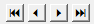

# Darstellung der Blätterbuttons

<!-- source: https://amic.de/hilfe/darstellungderbltterbuttons.htm -->

Will man Blätterbuttons in dieser Form darstellen und keine Bitmaps auf die Buttons legen, lässt sich dies mit einem einfachen Trick lösen: Man wählt als Schriftart „Webdings“ aus. Dort werden dann kleine Grafiken als Zeichen ausgeben.

Die Zeichen für die Buttons sind:

 9 für Anfang

3 für Links

4 für Rechts

: für Ende

Diese müssen dann einfach unter Beschriftung eingetragen werden.
