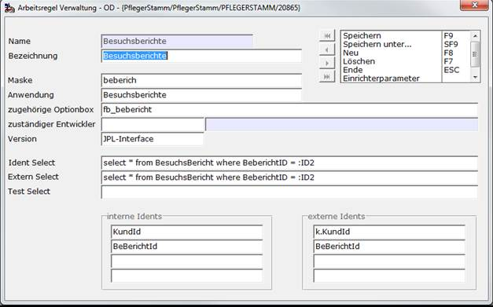

# Einen Stammdatenpfleger aus einem MAKRO heraus aufrufen

<!-- source: https://amic.de/hilfe/einenstammdatenpflegerauseinem.htm -->

Es kann wünschenswert sein, einen Bestehenden Stammdatenpfleger direkt aus einem Makro heraus aufzurufen. Dies kann z.B. Notwendig sein, wenn vorher bestimmte Bedingungen geprüft oder Vorbelegungen gemacht werden müssen. Dazu dient das JPP-Objekt „**JPfleger**“. Dieses verwendet für den Aufruf der Maske Daten, die im Pflegerstamm (Direktsprung **[PST]**) hinterlegt sind.

Beispiel für Besuchsberichte:



Aufruf Bebericht für einen neuen Besuchsbericht:

```text
SetLDB("TRANSFERS[1]",cKundId); // Die KUNDID muss im Einfügemodus über TRANSFERS[1] übergeben warden. Spezialität bei Besuchsberichten.
               if( JPPNEW ( "PFF" , "JPfleger" ) = 1 ) then
               {
                 JPPIN ( "PFF", "PST_STAMM", "Besuchsberichte" ) // Zu finden in der Anwendung „Pflegerstamm“ Direktsprung [PST]
                 JPPEX ( "PFF", "Einfuegen" )                  // „Einfuegen“ legt einen neuen Datensatz an
                 JPPDELETE ( "PFF" )
               }
```

Aufruf Bebericht für einen bestehenden Besuchsbericht:

```text
if( JPPNEW ( "PFF" , "JPfleger" ) = 1 ) then
               {
                 JPPIN ( "PFF", "PST_STAMM", "Besuchsberichte" ) // Zu finden in der Anwendung „Pflegerstamm“ Direktsprung [PST]
                 JPPIN ( "PFF", "KundId",     cKundId )          // Siehe Idents im Pflegerstamm
                 JPPIN ( "PFF", "BeBerichtId", cBEbeId )         // Siehe Idents im Pflegerstamm
                 JPPEX ( "PFF", "Aendern" )                    // „Aendern“ Ruft einen bestehenden Besuchsberich ab. Für
                                                                 // bestehende Besuchsberichte müssen alle Idents, also KundID und Beberichtid
                                                                 // angeben werden
                 JPPDELETE ( "PFF" )
               }
```

Will man einen Besuchsbericht nur ansehen, so ist der Syntax wie bei dem Aufruf des bestehenden Besuchsberichts, nur ersetzt man das Schlüsselwort **„Aendern“** durch **„Ansehen“**.
