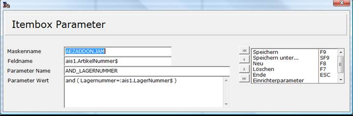

# Parameter an F3-Auswahlen (Itemboxen) übergeben

<!-- source: https://amic.de/hilfe/parameteranf3auswahlenitemboxe.htm -->

Ab und an steht man vor der Aufgabe, dass man in einer Itembox die Auswahl schon über bereits erfasst Werte einschränken möchte. Ein typisches Beispiel wäre, dass man bereits die Lagernummer erfasst hat und anschließend in der Itembox für Artikel nur noch die Artikel dieses Lagers sehen möchte. Zur Lösung dieses Problems steht die Anwendung „Itembox-Parameter“ (Direktsprung AIP) zur Verfügung. Dort kann man dann Angeben, dass zu einer Itembox ein Parameter gesetzt wird, wie es von ITEM_PAR bekannt ist.

Hier wird für die Itembox die man auf das Feld „ais1.ArtikelNummer$“ (auch hier auf Groß- und Kleinschreibung achten!) gelegt hat der Parameter AND_LAGERNUMMER – dieser muss entsprechend in der Itembox vorhanden sein – der Wert „and (Lagernummer=:ais1.LagerNummer$)“ hinterlegt.
