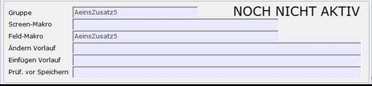
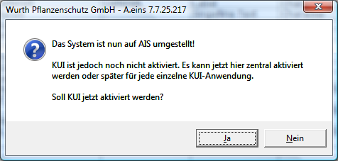

# Umstellung KUI/AO -> AIS

<!-- source: https://amic.de/hilfe/umstellungkuiaoais.htm -->

Hauptmenü > Administration > Werkzeuge > Informationssystem

Direktsprung **[AIS]**

Das System muss per Schalter vom alten System auf AIS umgestellt werden. Dieser Schalter befindet sich in der Anwendung „A.eins Informationssystem“. Die Funktion „***AIS aktivieren***“ führt dann eine Umstellung durch. Bei der Umstellung auf AIS wird versucht, die bestehenden Einrichtungen so zu übernehmen. Dabei gibt es natürlich die Einschränkung, dass Prozeduren, die auf Maskenfelder zugreifen jetzt evtl. Probleme bekommen, da die Felder anders benannt werden. Diese Prozeduren müssen manuell angepasst werden. Nach der Umstellung kann auf dem aktuellen Arbeitsplatz sofort mit AIS gearbeitet werden, alle anderen Anwender müssen einmal A.eins neu starten.

Das alte Addon-System wird sofort für AIS aktiviert, das KUI-System wird zwar auch übernommen, jedoch noch nicht für AIS aktiviert. Bei allen Gruppen erscheint auf der Bearbeitungsmaske dann der Text „NOCH NICHT AKTIV“ neben dem Namen der Gruppe. Zusätzlich steht dann eine Funktion „***Aktivieren***“ bereit. Erst wenn diese Funktion aufgerufen wird, wird diese Kuiseite über das AIS-System gesteuert.

Dies hat den Vorteil, dass AIS in Ruhe getestet und umgestellt werden kann, ohne dass der Arbeitsalltag dadurch gestört wird! Alle alten Daten von KUI und ADDON bleiben so wie sie sind bestehen und können jederzeit angesehen werden.

**ACHTUNG:** *Es ist **NICHT** mehr möglich wieder auf den alten Modus zurück zu schalten.*

Diese Umstellung übernimmt einen Großteil der Arbeit, jedoch ist es so, dass sich die internen Feldnamen im neuen System von den alten unterscheiden. Wenn das bisherige Kui/Addonsystem auf ihrem System so aufgebaut war, dass Feldnamen an Prozeduren / Makros weitergereicht werden, so ist es wahrscheinlich notwendig diese von Hand anzupassen. Am Ende der Umstellung erscheint dann eine Meldung, dass das System vollständig umgestellt wurde. Existieren KUI-Einrichtungen, so wird noch gefragt, ob diese jetzt aktiviert werden sollen.

Wenn man hier **Ja** wählt sind alle KUI Seiten sofort für AIS aktiviert und man verliert den Vorteil, die Umstellung in Ruhe zu testen.
