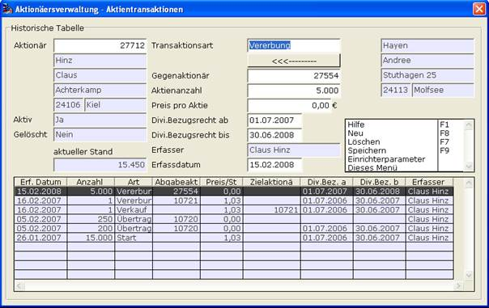

# Aktientransaktionen / Die Historische Tabelle

<!-- source: https://amic.de/hilfe/_aktientransaktionend.htm -->

In der Historischen Tabelle, die von den Listen „Aktionärsübersicht“, „Gesamtliste“ und „Aktionärsdividende“ aus aufgerufen werden kann, können die Aktientransaktionen für einen Aktionär erfasst und gepflegt werden. Die Maske wird für den in der Liste angewählten Aktionär gestartet. Dieser gilt als Hauptaktionär und seine Daten werden auf der linken Seite dargestellt. Es ist allerdings auch möglich, im Feld der Aktionärsnummer einen anderen Aktionär anzuwählen. In der unteren Tabelle werden die Transaktionen für diesen Aktionär in chronologischer Reihenfolge angezeigt. Die angewählt werden können. Die Daten für die gewählte Transaktion werden in der Mitte der Maske dargestellt und können dort editiert werden. Die oberste Transaktion wird automatisch beim Öffnen der Maske ausgewählt [vergleiche Die Unternehmensdaten einrichten/verwalten].

Folgende Einstellungen können in dieser Maske per Einrichterparameter vorgenommen werden:

- **Verhalten bei Überschreitung der ausgegebenen Aktienanzahl**
  - FEHLER – Falls eine Transaktion der Art „Start“ erfasst wird, durch die die ausgegebene Aktienanzahl überschritten wird, so erfolgt eine Fehlermeldung und die Transaktion kann nicht gespeichert werden.
  - WARNUNG – Hier erfolgt im obigen Falle eine Warnmeldung. Die Transaktion kann aber nach Bestätigung der Nachfrage gespeichert werden.
  - IGNORIEREN – Die Transaktion kann gespeichert werden.

Eine neue Transaktion für den Hauptaktionär kann durch Anwahl einer leeren Zeile in der Tabelle oder durch die Funktion ***Neu*** erfasst werden.

Für eine Transaktion muss eine Art angeben werden. Diese kann „Start“, „Kauf“, „Verkauf“, „Übertragung“ oder „Vererbung“ sein. Die Starttransaktion ist zur Abbildung des Neukaufes von Aktien von einem Aktionär vom Unternehmen. Bei der „Übertragung“ und der „Vererbung“ muss eine Richtung angegeben werden, in der die Aktien fließen. Danach ist, für alle Transaktionsarten außer „Start“ ein Gegenaktionär anzugeben, mit dem der Hauptaktionär das Geschäft tätigt. Die Daten des Gegenaktionärs werden im rechten Bereich der Maske angezeigt. Dann erfolgt die Eingabe der Aktienanzahl und des Preises pro Aktie bei diesem Geschäft. In den Feldern „Divi. Bezugsrecht ab“ und „Divi. Bezugsrecht bis“ kann der Zeitraum eingegeben werden in dem der Hauptaktionär die Dividende für das erfasste Aktienpaket erhält. Dieser Zeitraum kann das komplette Wirtschaftsjahr, das halbe Wirtschaftsjahr oder auch leer sein. Dies bedeutet, dass die möglichen Eingaben für das „Dividendenbezugsrecht ab“ der 01.01. oder der 01.07. und für das „Dividendenbezugsrecht bis“ der 31.12. oder der 30.06. sind. Der Gegenaktionär bekommt automatisch das Dividendenbezugsrecht für den restlichen Teil des Wirtschaftsjahres. Das Wirtschaftsjahr der Dividende wird aus dem Erfassdatum ermittelt. Wenn der Hauptaktionär Aktien abgibt, kann er kein Dividendenbezugsrecht für das Wirtschaftsjahr erhalten, dann wird hier keine Eingabe vorgenommen. Er kann das Dividendenbezugsrecht für die erste Hälfte des Wirtschaftsjahres bekommen. Dann wird hier der Zeitraum der ersten Hälfte des Wirtschaftsjahres eingetragen. Oder er kann das volle Dividendenbezugsrecht für das Wirtschaftsjahr erhalten. Dann wird hier das volle Jahr eingetragen. Im Falle eines Verkaufs kann das Dividendenbezugsrecht frühestens ab der Hälfte des Wirtschaftsjahres abgegeben werden. Für den Fall, dass der Hauptaktionär Aktien erhält gilt dies analog. Falsche Datumseingaben werden nicht zugelassen oder korrigiert. Durch die Funktion ***Speichern*** **F9** wird die Transaktion gespeichert. Es kann keine Transaktion erfasst werden, bei der der Bestand eines der beteiligten Aktionäre negativ wird. Ähnlich wird verfahren, wenn man eine Transaktion editieren will. Dann wählt man einfach die entsprechende Transaktion in der Tabelle aus, editiert die Werte und speichert diese wieder. Man kann dann auch diese ausgewählte Transaktion durch ***Löschen*** **F7** löschen. In der Tabelle werden die oben beschriebenen Werte für eine Transaktion angezeigt. Wobei der Gegenaktionär natürlich als Abgabe- oder als Zielaktionär auftauchen kann. Der Hauptaktionär wird bei der Anzeige des Abgabe- bzw. Hauptaktionär ausgeblendet. Transaktionen, die ein Wirtschaftsjahr betreffen, das bereits abgeschlossen wurden können nicht mehr verändert oder gelöscht werden.
