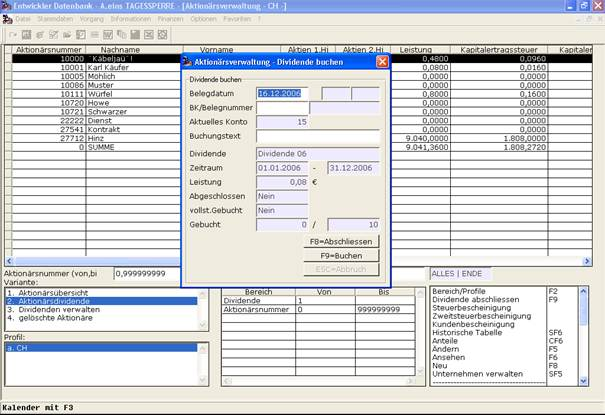

# Dividenden abrechnen

<!-- source: https://amic.de/hilfe/_dividendenabrechnen.htm -->

Nach dem für die Aktionäre die Transaktionen für das Wirtschaftsjahr erfasst wurden und die Dividendendaten eingetragen wurden, kann die Dividende abgeschlossen und ausgeschüttet werden. Dies geschieht aus der Liste „Aktionärsdividende“ heraus durch die Funktion ***Dividende abschließen*** **F9**. Nach Anwahl dieser Funktion öffnet sich die Maske zum Abschließen der Dividende. In dieser Maske kann die Dividende durch Anwahl des Knopfes ***Abschließen*** **F8** kann die Dividende abgeschlossen werden. Dies bedeutet, dass alle Werte wie Transaktionen, Unternehmensdaten, Dividendendaten und die ausgerechneten Dividenden für die einzelnen Aktionäre festgeschrieben werden und nicht mehr verändert werden können.

Dann können die Buchungen für die Aktionäre erzeugt werden. Dazu müssen vorher in dieser Maske noch einigen Daten wie das Belegdatum der zu erzeugenden Belege, die Belegkreisnummer aus denen die Belegnummern für die zu erzeugenden Belege stammen und einen Buchungstext, der auf den Belegen abgebildet wird, erfasst werden. Danach kann das Erzeugen der Belege für die Finanzbuchhaltung gestartet werden. Für jeden angewählten Aktionär wird die Buchung erzeugt. Ist kein Aktionär angewählt, wird jede Buchung erzeugt. Mit **ESC** kann der Vorgang abgebrochen werden. Zusätzlich sind in der Maske noch die Dividendendaten und zusätzlich ein Zähler dargestellt, an dem man ersehen kann wie viele Buchungen von wie vielen bereits erzeugt wurden.

