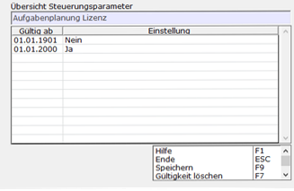
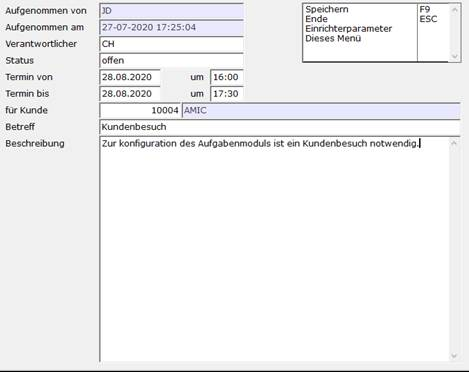

# Schritt für Schritt

<!-- source: https://amic.de/hilfe/_aufgabenplanungsfs.htm -->

Schritt 1.1: SPA aktivieren

Zuerst mit dem Direktsprung **[SPA]** in die Auswahlliste der SPAs. Dann nach dem SPA „1065“ suchen und die Lizenz aktivieren.

Schritt 1.2: Beispiel Szenario

Ein Teamleiter datiert für einen Mitarbeiter, einen Termin mit einem Kunden.

Der Teamleiter legt eine Aufgabe für den Mitarbeiter an:

- Mitarbeiter in die Aufgabe eingetragen
- Kunde wird in die Aufgabe eingetragen
- Datum wird in die Aufgabe eingetragen

Schritt 1.3: Beispiel in A.eins

Zuerst navigiert man mit dem Direktsprung **[TODO]** in die Auswahlliste der Aufgabenplanung. Danach erstellt man mit **F8** einen neuen Datensatz.

Als letztes speichert man den Datensatz ab (**F9**).

