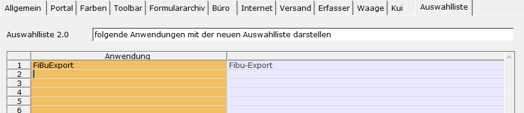

# Aktivierung des neuen Auswahllisten-Designs

<!-- source: https://amic.de/hilfe/aktivierungdesneuenauswahllist.htm -->

Hauptmenü > Administration > Firmenkonstanten > Bediener > Register Auswahlliste

oder Direktsprung [BD]

Bei neuanlage eines Bedieners ist die neue Auswahlliste aktiv, kann aber pro Anwendung auf das alte Design zurückgestellt werden. Des geschieht im Bedienerstamm (Direktsprung **[BD]**) auf dem Register Auswahlliste. Als erstes kann man sich entscheiden, was für den Benutzer standard sein soll.

- **folgende Anwendungen mit der neuen Auswahlliste darstellen:** Hier bleibt Grundsätzlich das alte Design aktiv, bis auf die in der darunter liegenden Tabelle ausgewählten Anwendungen. Dies ist zur Zeit die Standardeinstellung.
- <strong>folgende Anwendungen NICHT mit der neuen Auswahlliste darstellen:</strong> Hier ist die Sichtweise genau anders herum. Das neue Design ist grundsätzlich aktiv, bis auf die Anwendungen, die man in der Tabelle angegeben hat.
