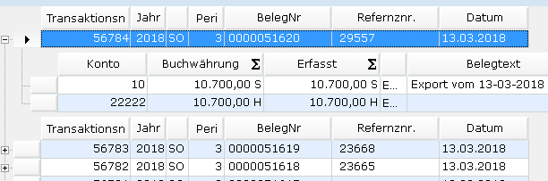
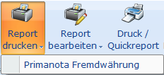
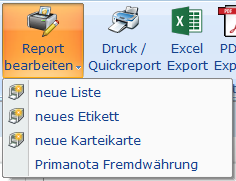
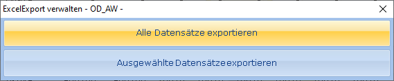
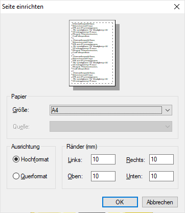

# Anwendungsregister

<!-- source: https://amic.de/hilfe/anwendungsregister.htm -->

Fast alle Funktionen des Anwendungsregisters lassen sich auch über eine Funktionstaste aufrufen. Welche Tasten sich hinter den Schaltflächen verbergen, wird in A.eins in einem Tooltipp angezeigt, wenn man mit dem Mauszeiger über der Schaltfläche stehen bleibt.

| | **Funktionstaste** | **Bedeutung** |
| --- | --- | --- |
| Varianten | **Strg+1** bis ggf. **Strg+9** | Hier lassen sich die Varianten der Auswahlliste auswählen. Die Auswahl erfolgt entweder per Maustaste oder – wenn die Varianten bekannt sind – über die Tasten **Strg+1** bis ggf. **Strg+9**  |
| Profile | | Die Profile lassen sich nur mit der Maustaste ändern.  |
| Ansicht  | | Hierüber kann eine [Ansicht](../ansichten_verwalten.md) ausgewählt werden. Diese Schaltfläche wird ausgeblendet, wenn für den Bediener nur die Standardansicht verfügbar ist. Die Ansichten lassen sich nur mit der Maustaste ändern-  |
| Bereich | **F2** | Durch Klicken auf die Schaltfläche  öffnet sich die bekannte Bereichsauswahl. Der Aufruf kann auch mit der Funktionstaste **F2** erfolgen. Diese Funktion läßt sich nicht wegschützen.  |
| Aktualisieren | **Strg+R** | Durch Klicken auf die Schaltfläche  werden die Daten mit der aktuellen Einstellung erneut aus der Datenbank gelesen. Die zugehörige Tastenkompindation lautet **Strg+R** (wie Refresh). Diese Funktion läßt sich nicht wegschützen.  |
| Gruppierung | **Strg+G** | Bei einigen Varianten erscheint eine weitere Schaltfläche. Die Anzeige unterscheidet sich durch ein Kreuz an der linken Seite, mit dem die Daten aufblättern kann. Es werden in diesen Varianten erst einmal nur noch einige zentralle Informationen angezeigt:  Durch Klicken auf das Kreuz bzw. durch Drücken der Taste „**Einfg**“ kann der Detailbereich für die aktive Zeile aufgeblätter und durch Klicken auf das Minus-Zeichen bzw. durch Drücken der Taste „**Entf**“ kann er wieder geschlossen werden. Man kann auch gleichzeitig alle Daten aufblättern oder wieder schließen, indem man die Tasten + bzw – auf dem Nummernblock verwendet. Wenn man die Schaltfläche  betätigt oder die Tastenkombination **Strg+G** drückt, kann man zwischen dieser und der einfachen Darstellung der Daten hin und her schalten. Es wird sich pro Varinate die letzte Einstellung gemerkt. Diese Gruppierung kann im SQL-Text in den FIELD-Zeilen durch das Schlüsselwort GROUP=… eingerichtet werden. Diese Funktion läßt sich nicht wegschützen.  |
| Bereich | **Strg+Y** | Hier werden die in der Bereichsauswahl ausgewählten Eingrenzungen angezeigt. Dieser Bereich lässt sich ein- und ausblenden, indem man auf das kleine Symbol  in der rechten unteren Ecke klickt. Durch das Ausblenden werden diese Einstellungen **nicht** deaktiviert. Durch Anklicken einer Zeile im Bereich öffnet sich die bekannte Bereichsabfragemaske und die Schreibmarke steht gleich in der angewählten Zeile. Mit der Tastenkombination **Strg+Y** wird auf die Eingabe des Schnellauswahlkriteriums umgeschaltet.  |
| Ändern Ansehen Neu Löschen | **F5** **F6** **F8** **F7** | Existieren zu einer Auswahlliste Bearbeitungsfunktionen, so erscheinen diese auch im Menü-Band. Sie sind über die Funktionstasten **F5**\=Ändern, **F6**\=Ansehen, **F7**\=Löschen und **F8**\=Neu zu erreichen. **Technischer Hinweis zum Rollensystem und Stammdatenpflegern:** Wenn hier Stammdatenpfleger aufgerufen werden, deren [Rollenkontext](../../../firmenstamm/firmenkonstanten/zuordnung_von_funktionen_zu_bedienerklassen_rollen/rollenkontext/rollenkontext_pfleger.md) im Pflegerstamm [**PST]** hinterlegt sind, so wird die hier hinterlegte Rolle auch vom Stammdatenpfleger im „Ändern“-Modus ausgewertet. <ul><li>Ist Neu für die Rolle gesperrt, so wird im Stammdatenpfleger „Neu“ und „Speichern unter“ NICHT angeboten.</li><li>Ist Löschen für die Rolle gesperrt, so wird im Stammdatenpfleger „Löschen“ NICHT angeboten.  &nbsp;</li></ul> |
| Druck/Quickreport | **F4** | Um die bekannten Funktionen „Druck Kurzliste“ bzw. „Quickreport“ nutzen zu können, kann man hier in die „alte“ Auswahlliste verzweigen und dort diese Funktionalitäten wie bisher nutzen. Diese Funktion ist deaktiviert, wenn man in den Bearbeitungsmodus der Stapelverarbeitung gewechselt hat.  |
| Report drucken | | Druck der Daten aus der Auswahlliste mit aktiver Gruppierung und Eingrenzung laut Filterzeile. Diese Funktion verwendet den AMIC-Etikettendruck, für den man selbstständig Listen, Karteikarten oder Etiketten einrichten kann. Diese Funktion ist dann aktiv, wenn für diese Variante ein oder mehrere Reporte hinterlegt sind.  Die Funktion „***Report drucken***“ im Rechte-Maustaste-Menü führt keine Funktion aus, sondern bietet nur die Möglichkeit, die Druck-Funktion zu sperren.  |
| Reporte bearbeiten | | Einrichten/Bearbeiten der Reporte für diese Auswahlliste. Dieses Menü ist aktiv, wenn Daten angezeigt wurden. In dem Menü hat man die Möglichkeit neue Listen, Etiketten oder Karteikarten anzulegen. Dort wird nach einer Bezeichnung des Reports gefragt. Hat man einen Report erstellt, so erscheint diese Bezeichnung im Menü und man kann hier dann bereits erstellte Reporte erneut bearbeiten.  Die Funktion „***Reporte bearbeiten***“ im Rechte-Maustaste-Menü führt keine Funktion aus, sondern bietet nur die Möglichkeit, die Bearbeiten-Funktion zu sperren.  |
| Excel-Export | **Strg+X** | Hier können die Daten an Excel übergeben werden. Die Tastenkombination lautet **Strg+X**. Es existieren hier mehrere Möglichkeiten. Auf dem Darstellungsregister befindet sich eine Listbox, mit der eingestellt werden kann, welche der Exportfunktionen ausgeführt wird. Wenn dort „*Excel aus Datentabelle*“ steht, werden die Daten so übernommen – auch mit der ggf. aktiven Gruppierung – wie sie im unteren Bereich zu sehen sehen sind. Bei dieser Einstellung wird auch die in der Filterzeile angegebenen Eingreinzungen berücksichtigt. Beim Excel-Export besteht die Möglichkeit auszuwählen, ob nur die markierten Zeilen oder ob alle Daten exportiert werden sollen. Wird die Option „Ausgewählte Datensätze exportieren“ verwendet, so werden die Summen-Zeilen nicht mit exportiert.    Wenn dort „*Excel laut SPA*“ steht, so wird die bisherige Funktion zur Ausgabe der Daten ausgeführt. Gruppierung und Filterzeile werden **nicht** angewendet.  |
| PDF-Export | **Strg+P** | Ausgabe der Daten in eine Druckvorschau. Es werden die Daten aus der Datentabelle mit aktiver Gruppierung und Eingrenzung laut Filterzeile ausgegeben. Als erstes hat man die Möglichkeit die Seite einzurichten. **  **Bestätig man diesen Dialog mit OK, so öffnet sich ein Vorschaudialog. Während der Datenaufbereitung besteht die Möglichkeit den Vorgang abzubrechen. Es werden dann nur die bis zu diesem Zeitpunkt verarbeiteten Daten angezeigt.  |
| | **Strg+O** | Es wird OLAP aufgerufen. Bei dieser Funktion werden nur die Standard-Filter, die man über F2 eingegeben hat, berücksichtigt. Gruppierung und Filterzeile werden **nicht** angewendet.  |
| CSV-Export | **Strg+E** | Diese Funktion entspricht der bekannten Funktion zur schnellen Excel-Ausgabe die mit **Strg+E** aufgerufen werden kann. Es werden die Daten aus der Datentabelle mit aktiver Gruppierung und Eingrenzung laut Filterzeile ausgegeben. Eine wesentliche Verbesserung zu früher ist, dass die aus der Finanzbuchhaltung gebräuchlichen SH-Formate in Zahlen mit Vorzeichen umgewandelt werden. Dadurch kann in Excel direkt mit diesen Zahlen gerechnet werden.  |
| Export in Ascii-Datei | **Strg+I** | Hier wird die Funktion „Export in Ascii-Datei“ aufgerufen, über die z.B. der IDEA –Export durchgeführt werden kann. Gruppierung und Filterzeile werden **nicht** angewendet. **Hinweis:** *Um den CSV-Export zu starten, braucht die Auswahlliste nicht gefüllt zu sein. Die Daten werden direkt aus der Datenbank gelesen und in die Exportdatei geschrieben. Dadurch können sehr große Datenmengen exportiert werden.*  |
| Senden an… | **Strg+M** | Die markierten Daten – wenn nichts markiert ist, dann alle Daten – werden in eine einfache Tabelle geschrieben und als Mail geöffnet. Gruppierung und Filterzeile werden **nicht** angewendet. Diese Funktion kann auch mit **Strg+M** (wie Mail) aufgerufen werden.  |
| Word / Serienbrief | | Bearbeitung und Druck von [Serienbriefen](../serienbrief/index.md). Es wurde eine neue Serienbriefverarbeitung – basierend auf einer Excel–Datenquelle – integriert. Die Funktion „***Word / Serienbrief***“ im Rechte-Maustaste-Menü führt keine Funktion aus, sondern bietet nur die Möglichkeit, diese Funktion zu sperren.  |
| Menü | | Hier öffnet sich das Menü, das alle sonstigen Bearbeitungsfunktionen beinhaltet. Alle Funktionen, die bereits im Menü-Band dargestellt werden, sind hier nicht enthalten. Das komplette Menü kann man nach wie vor über die rechte Maustaste erreichen.  |
| Archiv ansehen | **Strg+F12** | Diese Funktion steht nicht in allen Varianten zur Verfügung. Sie ist nur dann aktiv, wenn genau ein Datensatz ausgewählt ist. Man kann diese Funktion mit der Tastenkombination **Strg+F12** aufrufen.  |
| Info-Fenster | **Strg+F11** | Wählt man diese Funktion, so öffnet sich ein zusätzliches Fenster, in dem die Daten der aktiven Zeile untereinander dargestellt werden. Die Auswahlliste bleibt dabei weiterhin aktiv. Größe und Position dieses Fensters können geändert werden und werden pro Variante gespeichert.  |
| Hilfe | **F1** | Die Dokumentation/Hilfe ist auch **F1** erreichbar.  |
| Legende | **Umschalt+F1** | Existiert zu der Auswahlliste eine Farblegende so erscheint diese Schaltfläche. Diese Information kann auch mit **Umschalt+F1** aufgerufen werden.  |
| Kopieren des Wertes einer Zelle | **Strg+C** | Kopiert den Wert der Zelle, die sich unter dem Mauszeiger befindet, in die Zwischenablage. |

Siehe auch:

- [F2-Bereichsauswahl](./f2_bereichsauswahl/index.md)
