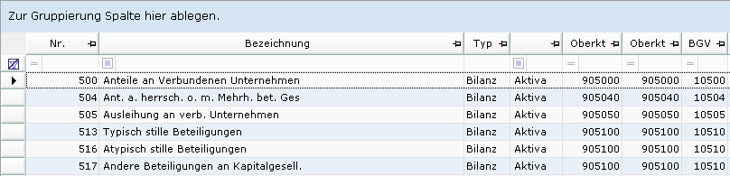
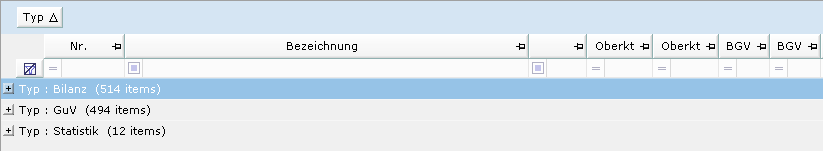
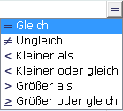
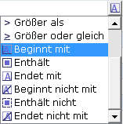
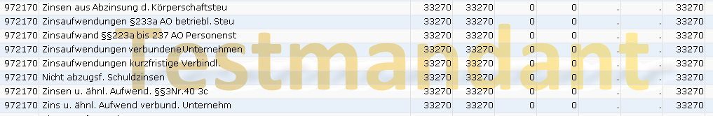

# Datentabelle

<!-- source: https://amic.de/hilfe/datentabelle.htm -->



Die Datentabelle enthält zusätzliche Funktionen:

#### Gruppieren:

Um die Daten eben schnell mal zu gruppieren, kann man in die Titelzeile klicken und die so ausgewählte Spalte in den Bereich ziehen, der mit „*Zur Gruppierung Spalte hier ablegen“* gekennzeichnet ist. Dann ändert sich das Erscheinungsbild wie folgt:



In diesem Beispiel wurde der Kontotyp „Typ“ in die Gruppierungsleiste gezogen. Man kann nun durch einen Mausklick auf das Kreuz ganz links (oder durch drücker der Plus/Minus Tasten auf dem Nummernpad) die Bereiche aufklappen.

Um die Gruppierung wieder zu entfernen, zieht man die Spalte wieder zurück in die Datentabelle.

<strong><u>Hinweis: </u></strong><em>Wird die Funktion „Gruppieren-Bereich“ weggeschützt, so wird der Bereich „Zur Gruppierung Spalte hier ablegen“ für diese Bedienerklasse nicht mehr angezeigt.</em>

#### Spalten fixieren:

Mit dem Schlüsselwort FIXCOL können bereits die Anzahl der Spalten im SQL-Text festgelegt werden, die beim horizontalen Scrollen nicht bewegt werden, also immer Links in der Datentabelle stehen bleiben. Mit dem kleinen Pin in der Titelzeile lassen sich Spalte fixieren. Diese Einstellung wird für jeden Anwender gespeichert und beim erneuten Aufruf der Variante wieder verwendet.

#### Filtern:

Die Filterzeile direkt unter der Überschrift dient dazu, schnell bestimmte Datensätze zu finden. Es wird bei dieser Methode nicht erneut auf die Datenbank zugegriffen, sondern nur in den Daten der Datentabelle gesucht. Auch werden diese Einstellungen nicht gespeichert.

Klickt man in den leeren Bereich, kann man einen Wert angeben oder aus den in Drop-Down-Liste angebotenen Werten eine auswählen. Mit der Tastenkombination **Strg+F** springt der Fokus direkt in die zuletzt verwendete Spalte des Filters. Mit den -Tasten **Tab** und **Shift-Tab** kann man zwischen den Spalten wechseln.

Das Symbol  dient zum zurücksetzen der Filter.

Das Symbol links unter der Überschrift bestimmt, wie gesucht werden kann, wobei hier zwischen numerischen und alphanumerischen Daten unterschieden wird:

| **Numerisch:** | **Alphanumerisch:** |
| --- | --- |
|  |  |

<strong><u>Hinweis: </u></strong><em>Wird dir Funktion „Filter“ weggeschützt, so wird die Filterzeile für diese Bedienerklasse nicht mehr angezeigt.</em>

#### Warnungen:

Es besteht die Möglichkeit mithilfe von einer privaten Datenbankfunktion Icons im Hintergrund der Liste zu aktivieren, um zu signalisieren, dass irgendetwas nicht in Ordnung ist. Dies kann sein, dass eine Datenübertragung nicht funktioniert hat, oder bereits irgendwelche Fristen abgelaufen sind. Diese Datenbankfunktion muss eine Zahl zwischen 0 und 3 zurückliefern, dabei bedeutet 0, dass kein Icon angezeigt wird.

| 1 = Information | 2 = Warnung | 3 = Fehler |
| --- | --- | --- |
|  |  |  |

Diese Warnungsfunktion wird in der [Ansichtsverwaltung](./ansichten_verwalten.md) eingetragen. Es ist auch möglich, diese Funktion im SQL-Text zu hinterlegen. Die Möglichkeit, die Warnungsfunktion in der Ansicht zu hinterlegen, ist einer privaten Ableitung vorzuziehen.

Im SQL-Text gibt man die Funktion mithilfe des Schlüsselwortes **WARNINGFUNCTION** an. Es müssen die Klammern mit angegeben werden:

```text
WARNINGFUNCTION p_prueffunktion()
Oder
WARNINGFUNCTION if db_bedienerid=-1 then 3 else 0 endif
```

[Hier](../a_eins_hinweis/warningfunction.md) findet sich beispielhaft eine mögliche Einrichtung.

#### Testmandant

Arbeitet man auf einem Testmandanten wird als Hintergrundbild immer dann der Schriftzug „Testmandant“ eingeblendet, wenn keine WARNINGFUNCTION eingerichtet ist oder diese den Wert 0 zurückliefert.  
   


#### Mandantengrafik

Handelt es sich nicht um einen Testmandanten und wurde keine Warnungsgrafik angezeigt, bleibt der Hintergrund normalerweise leer. Man kann aber für jeden Mandanten eine eigene Hintergrundgrafik hinterlegen. Diese Grafik muss den Namen Mandant.png haben und in dem Verzeichnis „.\\bin\\styles\\**MANDANTENNAME“** liegen.

#### Kopieren in die Zwischenablage:

Oft ist es so, dass man einen Wert aus der Datentabelle einfach schnell mal für eine andere Anwendung benötigt. Um einen Wert aus einer Zelle in die Zwischenablage zu bekommen, muss man mit der Maus über der Zelle stehen und kann dann mit der Tastenkombination **Strg+C** den Inhalt kopieren.
