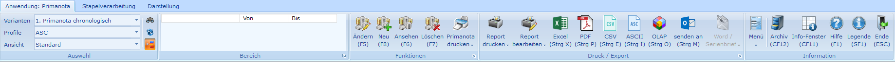
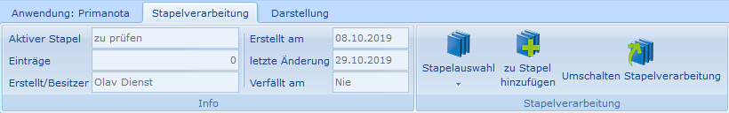
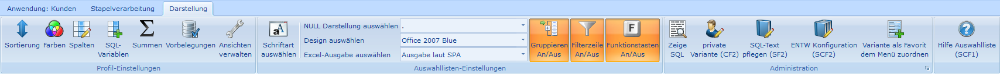

# Auswahlliste 2.0

<!-- source: https://amic.de/hilfe/auswahlliste20.htm -->

Das Design der Auswahlliste wurde komplett überarbeitet. Es wurde ein Menüband (Ribbon), wie man es von Word oder Excel kennt, verwendet. Dieses enthält zwei Register, das Anwendungsregister und das Darstellungsregister, auf denen die Funktionen dargestellt werden:

[Anwendungsregister](./anwendungsregister/index.md):

[Stapelverarbeitungsregister](./stapelverarbeitung/index.md): Dieses Register ist nur zu sehen, wenn für den Anwender Stapelverarbeitung aktiviert wurde und wenn die Auswahlliste eine IDENT-Verarbeitung zuläßt.

[Darstellungsregister](./darstellungsregister.md):

Alle hier verwendeten Funktionen befinden sich auch im Optionbox-Menü, das über die rechte Maustaste zu erreichen ist. Werden Funktionen im Optionbox-Menü weggeschützt, so sind sie im Menü-Band auch nicht mehr zugänglich.

Siehe auch:

- [Aktivierung des neuen Auswahllisten-Designs](./aktivierung_des_neuen_auswahllisten_designs.md)
- [Anwendungsregister](./anwendungsregister/index.md)
- [Darstellungsregister](./darstellungsregister.md)
- [Datentabelle](./datentabelle.md)
- [Statuszeile](./statuszeile.md)
- [Ansichten verwalten](./ansichten_verwalten.md)
- [Reporte verwalten](./reporte_verwalten.md)
- [Reporte bearbeiten](./reporte_bearbeiten.md)
- [Reporte exportieren](./reporte_exportieren.md)
- [Serienbrief](./serienbrief/index.md)
- [Stapelverarbeitung](./stapelverarbeitung/index.md)
- [Archiv mit der Auswahlliste 2.0](./archiv_mit_der_auswahlliste_2_0.md)
