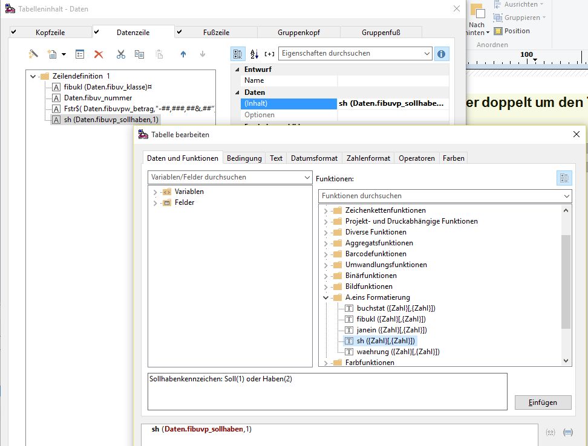
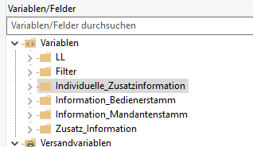
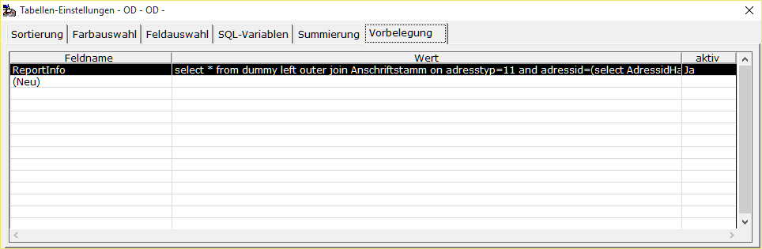

# Reporte bearbeiten

<!-- source: https://amic.de/hilfe/reportebearbeiten.htm -->

Die Reporte werden mit Hilfe des AMIC-Etikettendrucks bearbeitet. Hier gibt es folgende Besonderheiten:

#### FS-Formate

Die Daten werden in der Form dargestellt, wie sie in der Datenbank stehen. D.h. das Feld FIBUVP_SOLLHABEN wird als 1 oder 2 dargestellt. Will man nun im Report die textliche Darstellung sehen, so muss und kann man dies dem Report mitteilen. Dafür existieren in Dialog „Tabelle bearbeiten“ in der Funktionsgruppe „A.eins Formatierung“ alle in der aktiven Auswahlliste verwendeten FS-Formte. Der Name der Funktion entspricht dem FS-Format. Im unteren Beispiel sieht man wie der Syntax dieser Funktionen ist.

Der erste Parameter ist der Zahlenwert, der als Text umgewandelt wird. Der zweite Parameter ist Optional und gibt die Anzahl der Zeichen an, die ausgegeben werden sollen. Würde man im unteren Beispiel die Länge weglassen, dann würde statt „S“ und „H“ in dem Report „Soll“ bzw. „Haben“ erscheinen.

#### Zusätzliche Variablen

Für die Reporte existieren zusätzliche Variablen.

Unter „*Filter*“ werden Variablen – Label und Value - mit den Bereichseingrenzungen und den Filtereinstellungen bereitgestellt.

Unter *„Individuelle Zusatzinformation“* stehen Informationen, die über die Darstellungsfunktion „Vorbelegung“ im Feld „ReportInfo“ definiert wurden.

Dort kann auf ein View, Tabelle oder auf eine Prozedur zugegriffen werfen:

Der Wert muss als „select …“ definiert werden. Das Ergebnis sollte immer einen Datensatz zurückliefern, und zwar auch dann, wenn keine Daten vorhanden sind. Das Ergebnis findet man dann unter „individuelle Zusatzinformation“

Unter „*Information Bedienerstamm*“ stehen die Informationen, des Anwenders, der die Liste druckt.

Unter „*Information Mandantenstamm*“ stehen die Informationen zum Mandanten.

Unter *„Zusatz Informationen“* stehen die Werte, die aus einer privaten View mit dem Namen „p_ReportHeaderInformation“ liefert.

**Achtung:** *Diese View gilt für alle Auswahllisten-Reporte und sollte nur einen Datensatz liefern.*

**Hinweis:** Eine Übersicht über alle existierenden Reporte findet man in der Anwendung „Anwendung administrieren“ (Direktsprung <strong>[ANW])</strong> in der Variante „Anwendungsreporte“.
