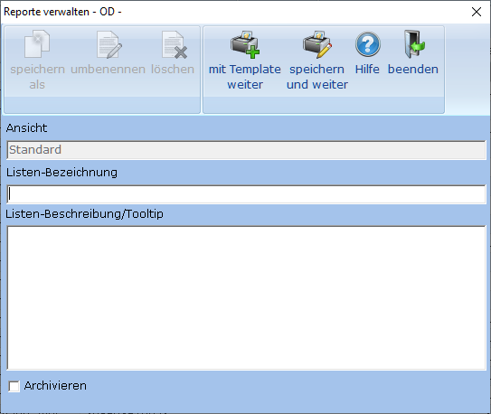
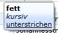

# Reporte verwalten

<!-- source: https://amic.de/hilfe/reporteverwalten.htm -->

Wenn man Reporte (Listen, Etiketten, Karteikarten) erstellt, so erscheint als erstes folgender Dialog.

Die Funktionen ***„speichern als“***, ***„umbenennen“***, und ***„löschen“*** sind erst aktiv, wenn man einen bereits erstellten Report erneut bearbeitet. Die Funktion ***„mit Template weiter“*** erscheint nur wenn man eine neue Liste erstellen möchte.

| | **Bedeutung** |
| --- | --- |
| speichern als | Hier kann man den Report kopieren. Dazu wird die Ansicht – diese muss für die Variante existieren – und der Reportname abgefragt.  |
| umbenennen | Hat man sich in der Bezeichnung vertan oder möchte sie aus anderen Gründen ändern, so kann man dies hier tun.  |
| löschen | Funktion zum Löschen eines Reports.  |
| mit Template weiter | Diese Funktion steht nur für den Projekttypen „Liste“ zur Verfügung. Es wird eine einfache Liste erstellt, in der alle sichtbaren Felder der Auswahlliste in einer Datentabelle aufgelistet werden. Man gelangt in den AMIC-Etikettendruck, in dem man dann diese Liste [bearbeiten](./reporte_bearbeiten.md) kann.  |
| Speichern und weiter | Mit dieser werden ggf. vorgenommene Änderungen an der Beschreibung gespeichert und man gelangt in den AMIC-Etikettendruck, in dem man dann die ausgewählte Liste/Etikette/Karteikarte [bearbeiten](./reporte_bearbeiten.md) kann.  |
| Ansicht | Zeigt die Bezeichnung der gerade aktiven Ansicht an.  |
| …-Bezeichnung | Dies ist die eindeutige Bezeichnung des Reports, die später im Menü erscheint. Die Bezeichnung muss pro Ansicht und Gruppierung eindeutig sein.  |
| …-Beschreibung/Tooltip | Diese Beschreibung wird als Tooltip im Bearbeiten-Menü bzw. im Druck-Menü angezeigt. Diese Beschreibung kann mithilfe einfacher Html-Tags formatiert werden: &lt;b>**fett**&lt;/b> &lt;i>*kursiv*&lt;/i> &lt;u>unterstrichen&lt;/u>  Diese Tags können auch kombiniert werden.  |
| Archivieren | Wird dieser Haken gesetzt, so wird der Report automatisch beim Druck archiviert. Zusätzliche Informationen wie Fa_Kundnummer, Fa_BelegtypText, uvm. können über die Funktion „[Vorbelegung](../darstellung_der_auswahlliste/standardvorbelegung_in_der_auswahlliste_definieren_nur_auswa/index.md)“ auf dem Darstellungsregister hinterlegt werden.  |

    
Mit der Funktion „speichern und weiter“ wird ggf. die Änderung der Beschreibung gespeichert und man gelangt in den AMIC-Etikettendruck, in dem man dann die ausgewählte Liste/Etikette/Karteikarte [bearbeiten](./reporte_bearbeiten.md) kann.

**Hinweis:** Eine Übersicht über alle existierenden Reporte findet man in der Anwendung „Anwendung administrieren“ (Direktsprung <strong>[ANW])</strong> in der Variante „Anwendungsreporte“.
