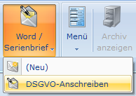
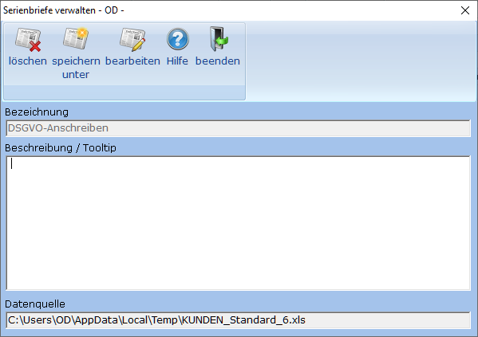
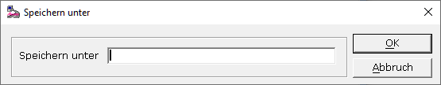

# Serienbrief bearbeiten

<!-- source: https://amic.de/hilfe/serienbriefbearbeiten.htm -->

Um einen bestehenden Serienbrief zu bearbeiten, wählt man im Menüband die Funktion ***„Word / Serienbrief“*** auf. In dem sich öffnenden Menü erscheinen nun neben der Funktion „(Neu)“ auch die neu erstellten Serienbriefe.

Wählt man einen der Serienbrief aus, so öffnet sich der Bearbeitungsdialog, in dem man ggf. die Beschreibung ändern kann.

Die Funktion ***„löschen“*** löscht den Eintrag aus dem Menü. Das Dokument selbst bleibt im Archiv erhalten.

Bei <strong>„speichern unter“</strong> wird nach einer neuen Bezeichnung gefragt unter der dieser Serienbrief gespeichrt werden soll. Existieren noch ungespeicherte Änderungen am Original, so wird man ggf. noch gefragt, ob man diese vorher speichern möchte.

Mit ***„bearbeiten“*** wird das Dokument wieder geöffnet. Um wieder auf die Seriendruckfelder zugreifen zu können, muss die Frage, ob man den SQL-Befehl ausführen möchte, mit Ja beantwortet werden.

<strong><u>ACHTUNG:</u> </strong><em>Beim Beenden des „Serienbrief verwalten“- Dialogs wird gefragt, ob man die Änderungen Speichern will. Erst wenn man diese Frage mit <strong>Ja</strong> beantwortet wird das geänderte Worddokument in der Datenbank gespeichert.</em>
