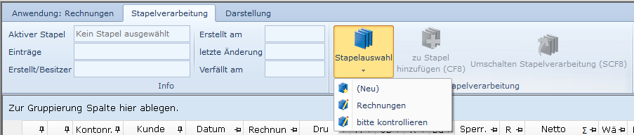
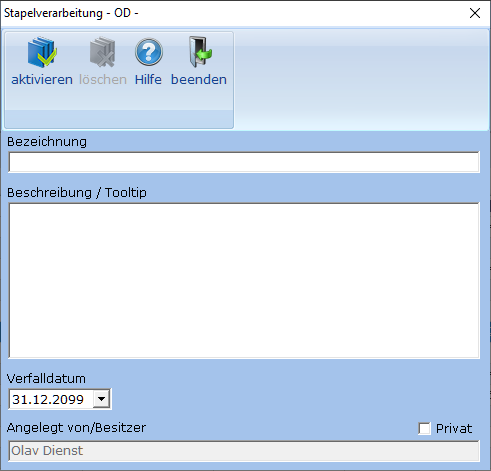
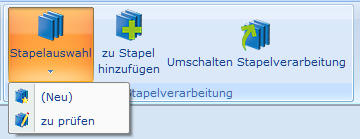

# Stapelauswahl

<!-- source: https://amic.de/hilfe/stapelauswahl.htm -->

Beim Betreten einer Anwendung ist erst einmal kein Stapel aktiv. Man kann einen Stapel anlegen, indem man Zeilen einem Stapel hinzufügt – dann wird entweder automatisch ein Stapel gebildet oder es öffnet sich eine Auswahl, wenn mehrere vorhanden sind – oder über die Stapelauswahl. Das Menü „Stapelauswahl“ steht nur zur Verfügung, wenn mit globalem Stapel gearbeitet wird, bei temporären Stapeln wird immer automaisch ein privater Stapel angelegt.

In diesem Menü befindet sich mindestens die Funktion „***(Neu)***“ und später dann die angelegten Stapel. Wähl man ***Neu*** oder einen angelegten Stapel aus, so öffnet sich dieser Dialog:

| | **Bedeutung** |
| --- | --- |
| aktivieren (**F9**) | Die Änderungen werden gespeichert, der Stapel wird zum aktiven Stapel und er wird links im Menüband angezeigt (statt „Kein Stapel ausgewählt“). Die Funktionen „***zu Stapel hinzufügen***“ **Strg+F8** und „***aus Stapel entfernen***“ **Strg+F7** beziehen sich dann auf diesen Stapel.  |
| löschen (**F7**) | Der Stapel wird komplett gelöscht und alle Datensätze aus ihm entfernt. Bei Neuanlage eines Stapels ist dieses Feld erst einmal deaktiviert. Steht man im Stapel – auf dem Register steht „Stapelverarbeitung (Bearbeitungsmodus)“ - und löscht einen Stapel, so wird der Stapel gelöscht und der Bearbeitungsmodus verlassen.  |
| Bezeichnung | Vergabe einer Bezeichnung. Diese Bezeichnung erscheint dann im Menü „Stapelauswahl“.   |
| Beschreibung / Tooltip | Hier kann man einen beliebigen Text hinterlegen. Dieser erscheint dann als Tooltip, wenn man in der Stapelauswahl mit der Maus über dem entsprechenden Eintrag steht.  |
| Verfalldatum | Datum, nach dem dieser Stapel automatisch gelöscht wird.  |
| Angelegt von/Besitzer | Name des Bedieners, der den Stapel erstellt hat oder den Stapel als „Privat“ gekennzeichnet hat. Dieses Feld wird nur angezeigt und kann nicht geändert werden.  |
| Privat | Wenn hier ein Haken gesetzt wird, so hat nur derjenige auf diesen Stapel Zugriff, der das Kennzeichen gesetzt hat. Derjenige, der den Stapel als privat markiert wird also automatisch Besitzer des Stapels.  |
